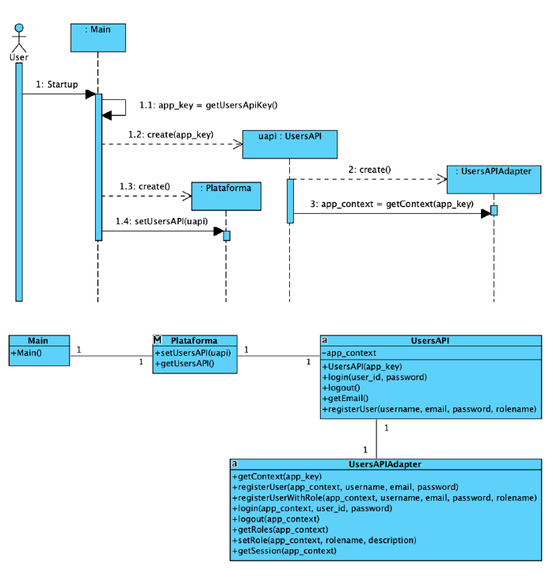
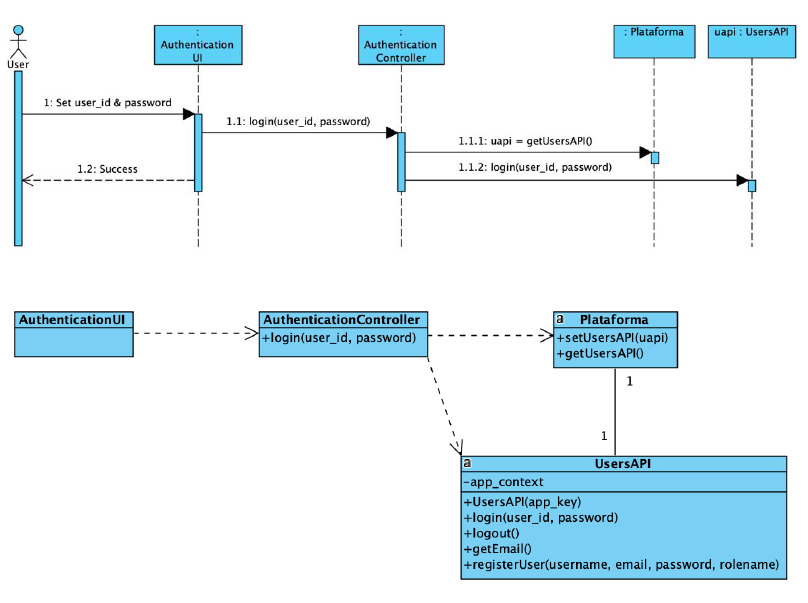

# API PARA GESTÃO DE UTILIZADORES

Apresenta-se de seguida uma sugestão de design para a utilização do serviço de gestão de utilizadores.

## Arranque da aplicação
No arranque da aplicação são criados os objetos necessários para o consumo do webservice.

## Consumo do webservice (exemplo: autenticação)

##### [Voltar ao Enunciado](Enunciado.md)
