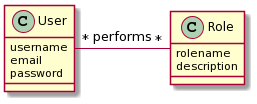
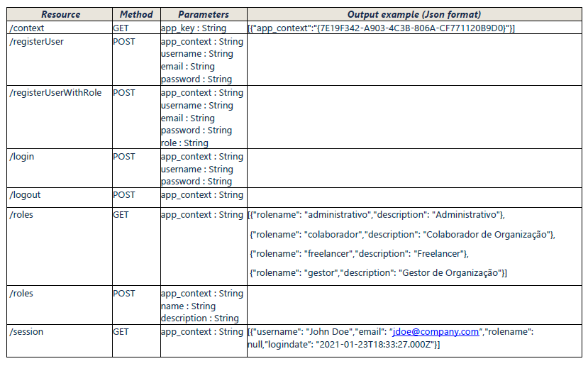

# GESTÃO DE UTILIZADORES

O componente de gestão de utilizadores irá ser desenvolvido por outra equipa de desenvolvimento que também é responsável pela sua manutenção/evolução. Este componente visa satisfazer um conjunto de requisitos/funcionalidades genéricas e comuns a várias aplicações. A autenticação dos utilizadores será realizada com um identificador de utilizador e palavra-passe.
Os conceitos principais abordados neste componente são apresentados de seguida.

De acordo com o modelo do domínio, um “User” desempenha vários “Role” (i.e. funções), sendo que o mesmo “Role” também pode ser desempenhado por vários “User”.
Este componente disponibiliza as suas funcionalidades através de um Web Service que está em conformidade com o estilo arquitetural REST (Representational State Transfer). A utilização do serviço apenas é possível a quem conhecer uma chave que é obtida após registo. A T4J já efetuou esse registo e já possui a respetiva chave, que fornecerá posteriormente à equipa de desenvolvimento.
Assim sendo, a documentação relevante com vista à sua utilização consiste na descrição dos métodos, endpoints, recursos, parâmetros e resultados de output esperados.

O Web Service disponibiliza os seguintes recursos:
- “GET /context(String app_key)”: permite obter uma chave de contexto que identifica uma sessão de utilizador. Esta chave de contexto será necessária para executar todos os restantes métodos disponíveis.
- “POST /registerUser(String app_context, String username, String email, String password)”: permite definir a existência de um novo utilizador que pode usar a aplicação;
- “POST /registerUserWithRole(String app_context, String username, String email, String password, String role)”: semelhante ao método anterior, com a vantagem de associar imediatamente um papel/função a esse utilizador;
- “POST login(String app_context, String user_id, String password)”: permite autenticar um utilizador com vista à utilização da aplicação. O parâmetro user_id pode ser o username ou o email do utilizador;
- “POST logout(String app_context)”: termina a sessão de utilizador que estiver ativa no momento;
- “POST /roles(String app_context, String name, String description)”: permite definir a existência de um novo papel/função de interesse para a aplicação;
- “GET /roles(String app_context)”: permite obter todos os papéis/funções existentes no sistema;
- “GET /session(String app_context)”: permite obter os dados da sessão ativa.

O Web Service associa à resposta a todos os pedidos realizados um HTTP response status code em concordância com a publicação RFC 2616, de junho de 1999, que definiu o HTTP/1.1. Por exemplo, serão devolvidos os códigos HTTP 200 (OK) a cada pedido corretamente processado, 401 (unauthorized) a cada pedido sem autorização (i.e. contexto inválido, credenciais inválidas, etc.) e 500 (internal error) para todas as situações representativas de erros internos do serviço.

##### [Voltar ao Enunciado](Enunciado.md)
