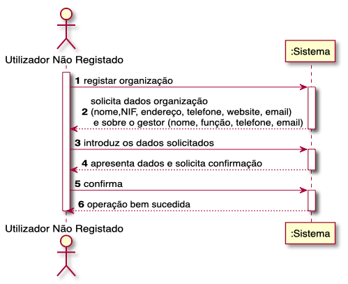
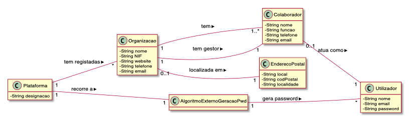
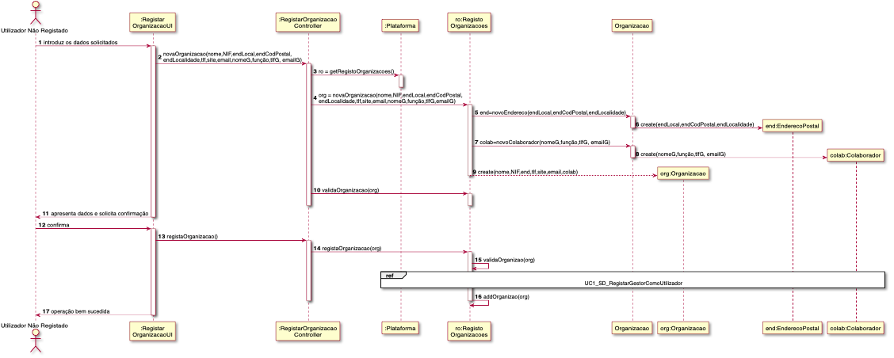
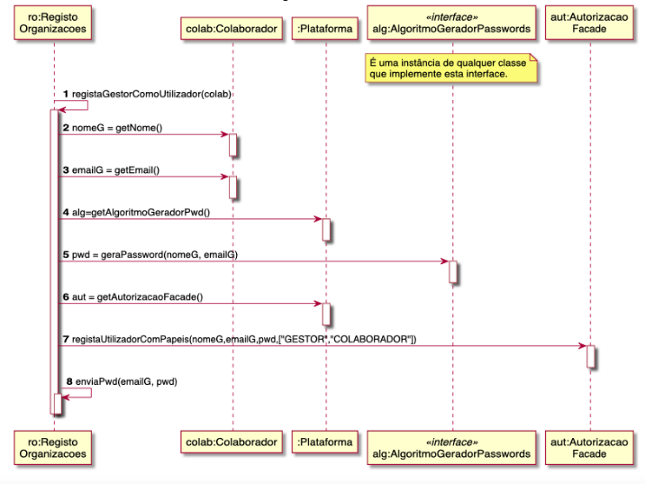
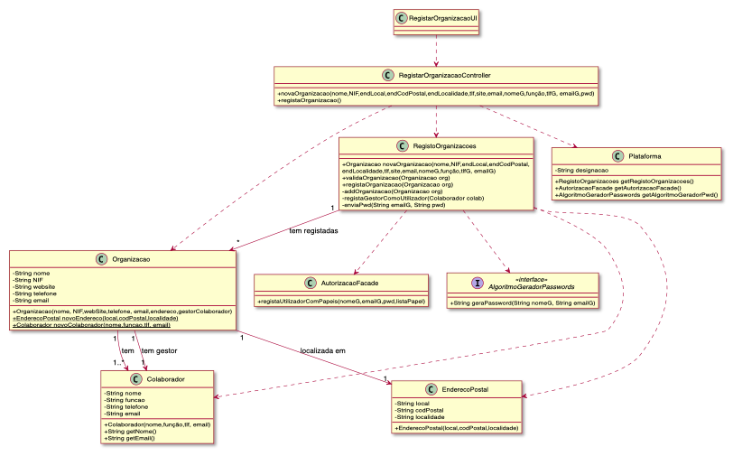
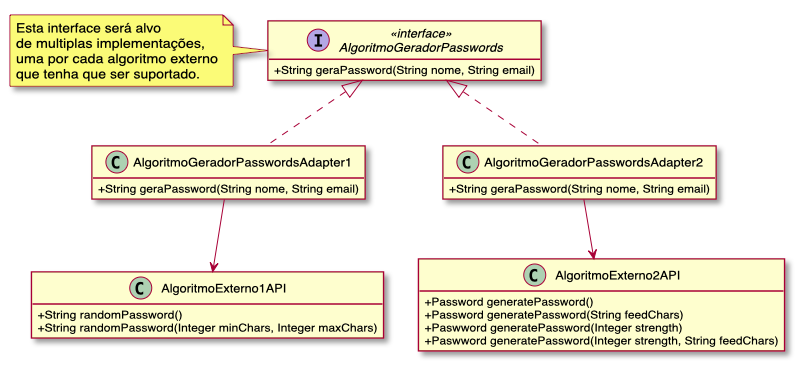

# UC01 – REGISTAR ORGANIZAÇÃO

O utilizador não registado inicia o registo de uma organização. O sistema solicita os dados necessários sobre a organização (i.e. nome da organização, o NIF, o endereço postal, um contacto telefónico, o endereço web, email) e sobre o colaborador (i.e. gestor) que está a proceder ao registo (i.e. nome, função, contacto telefónico e email). O utilizador não registado introduz os dados solicitados. O sistema valida e apresenta os dados, pedindo que os confirme. O utilizador não registado confirma. O sistema regista os dados da organização e do seu colaborador/gestor, tornando este último um utilizador registado, remetendo-lhe a sua palavra-passe (gerada pelo sistema) por email e informa o utilizador não registado do sucesso da operação.

## Diagrama de Sequência de Sistema

## Excerto do Modelo do Domínio

## Diagrama de Sequência

## Diagrama de Classes

##### [Voltar ao Enunciado](https://github.com/blestonbandeiraUPSKILL/upskill_java1_labprg_grupo2/blob/main/Documenta%C3%A7%C3%A3o/Sprint%202/Enunciado/Enunciado.md)
