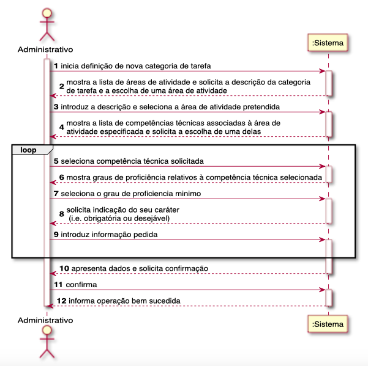
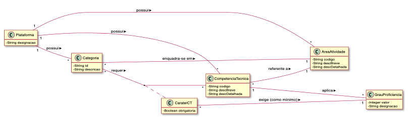
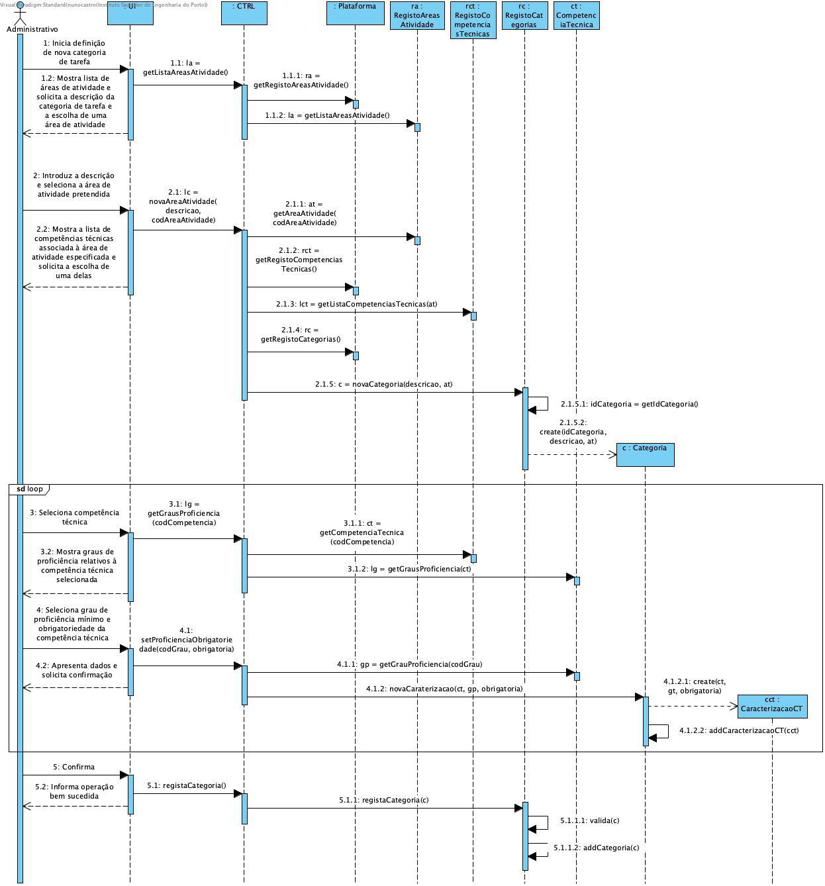

# UC03 - DEFINIR CATEGORIA DE TAREFA

O administrativo inicia a definição de uma nova categoria de tarefa. O sistema solicita os dados necessários (i.e. descrição, área de atividade e lista de competências técnicas requeridas e respetiva caracterização). O administrativo introduz os dados solicitados. O sistema valida e apresenta os dados ao administrativo, pedindo que os confirme. O administrativo confirma. O sistema regista os dados e informa o administrativo do sucesso da operação.

## Diagrama de Sequência de Sistema

## Excerto do Modelo do Domínio

## Diagrama de Sequência

##### [Voltar ao Enunciado](https://github.com/blestonbandeiraUPSKILL/upskill_java1_labprg_grupo2/blob/main/Documenta%C3%A7%C3%A3o/Sprint%202/Enunciado/Enunciado.md)
