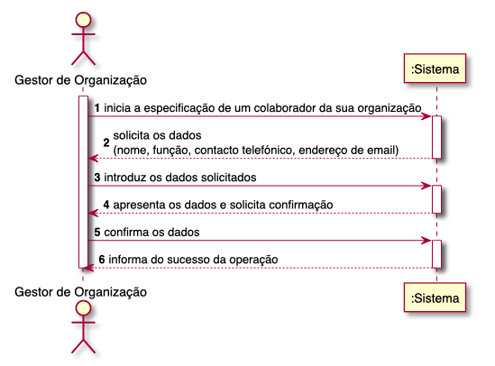
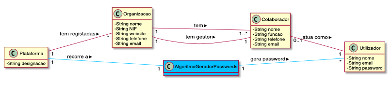
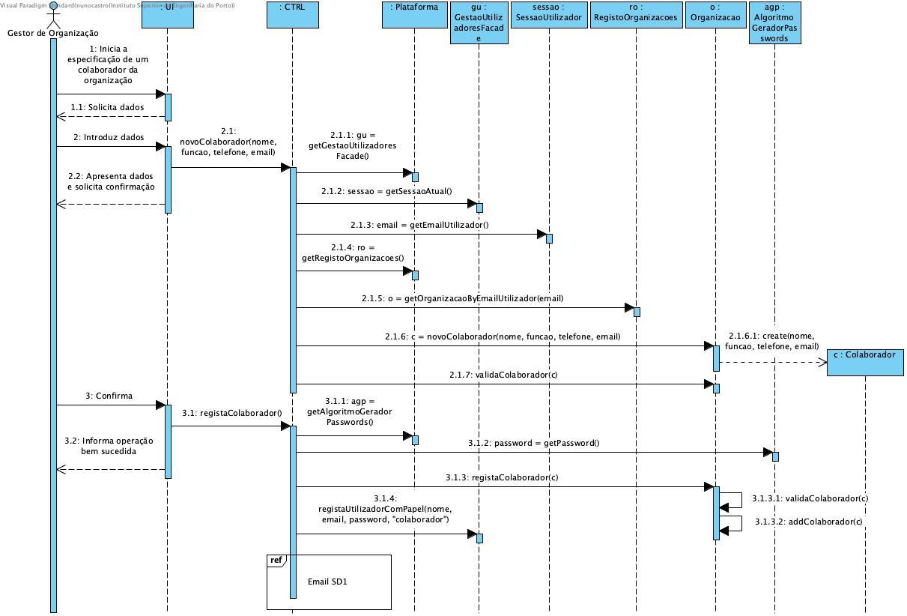

# UC05 - ESPECIFICAR COLABORADOR DE ORGANIZAÇÃO

O gestor de organização inicia a especificação de um colaborador da sua organização. O sistema solicita os dados necessários (i.e. nome, função, contacto telefónico, endereço de email). O gestor de organização introduz os dados solicitados. O sistema valida e apresenta os dados ao gestor de organização, pedindo que os confirme. O gestor de organização confirma. O sistema regista os dados do colaborador, gera uma password para o colaborador, tornando este num utilizador registado, envia, por email, os dados de acesso ao colaborador e informa o gestor de organização do sucesso da operação.

## Diagrama de Sequência de Sistema

## Excerto do Modelo do Domínio

## Diagrama de Sequência

##### [Voltar ao Enunciado](Enunciado.md)
