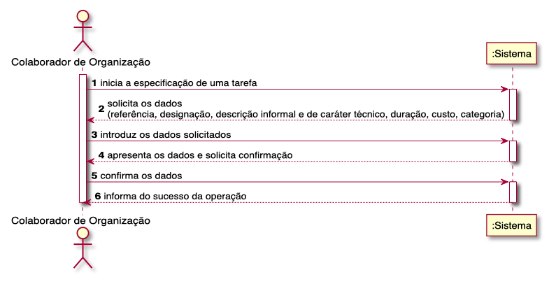
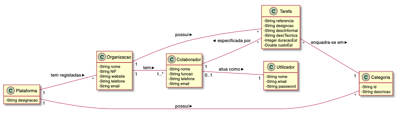
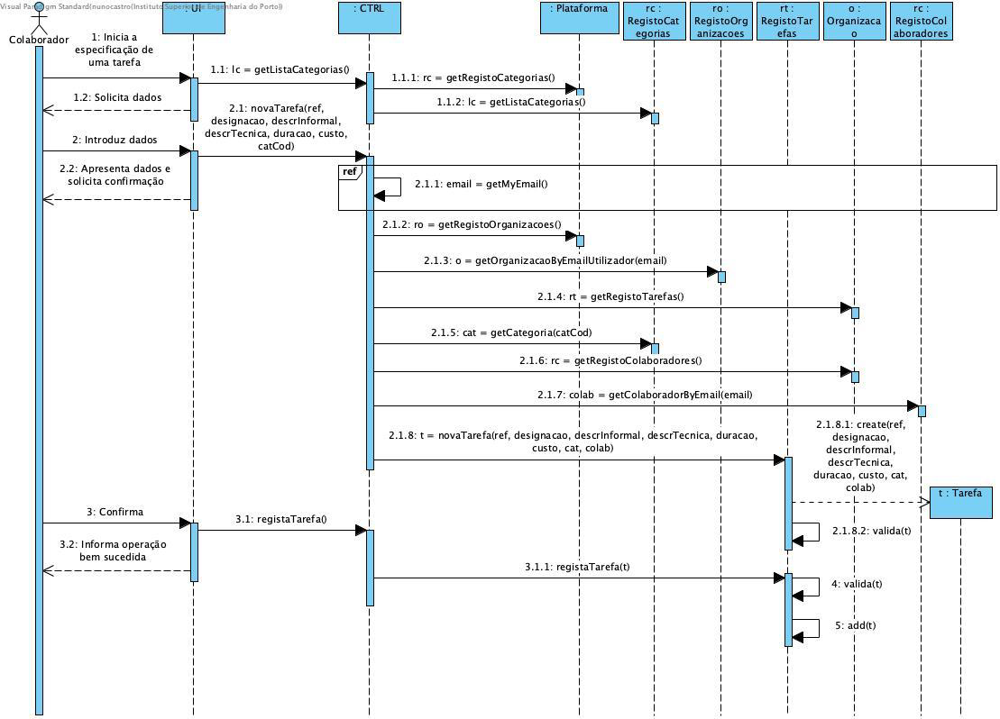
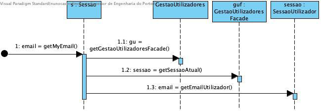

# UC06 - ESPECIFICAR TAREFA

O colaborador de organização inicia a especificação de uma tarefa. O sistema solicita os dados necessários (i.e. uma referência única por organização, uma designação, uma descrição informal e outra de carácter técnico, uma estimativa de duração e custo, a categoria). O colaborador de organização introduz os dados solicitados. O sistema valida e apresenta os dados ao colaborador de organização, pedindo que os confirme. O colaborador de organzação confirma. O sistema regista os dados e informa o colaborador de organização do sucesso da operação.

## Diagrama de Sequência de Sistema

## Excerto do Modelo do Domínio

## Diagrama de Sequência

##### [Voltar ao Enunciado](https://github.com/blestonbandeiraUPSKILL/upskill_java1_labprg_grupo2/blob/main/Sprint%202%20-%20Documenta%C3%A7%C3%A3o/Enunciado/Enunciado.md)