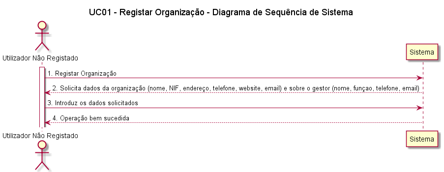
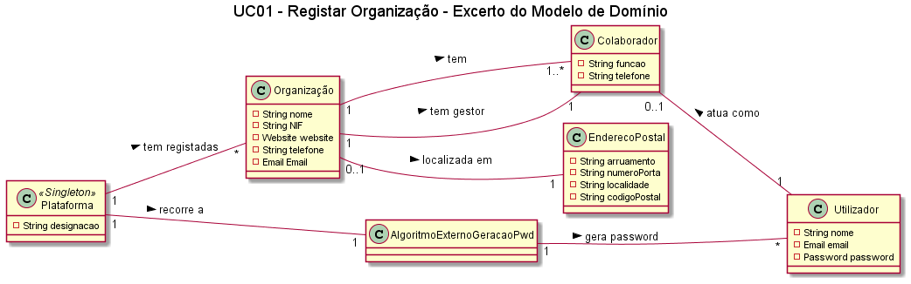
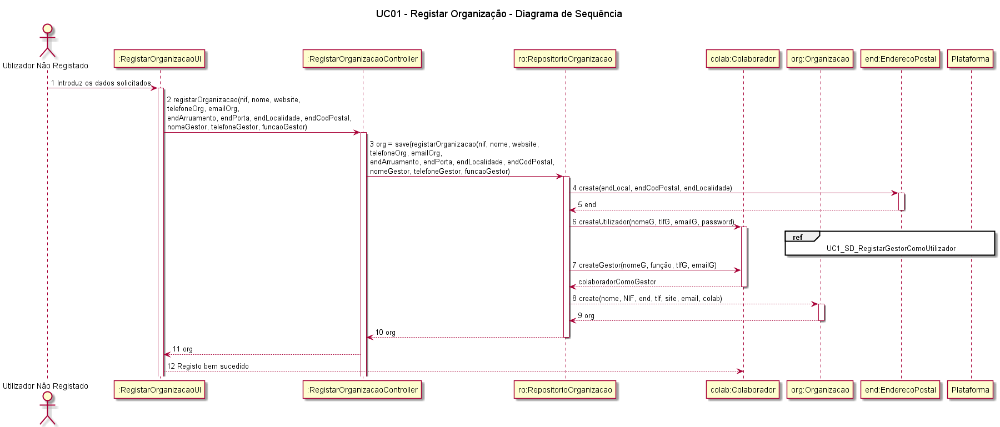
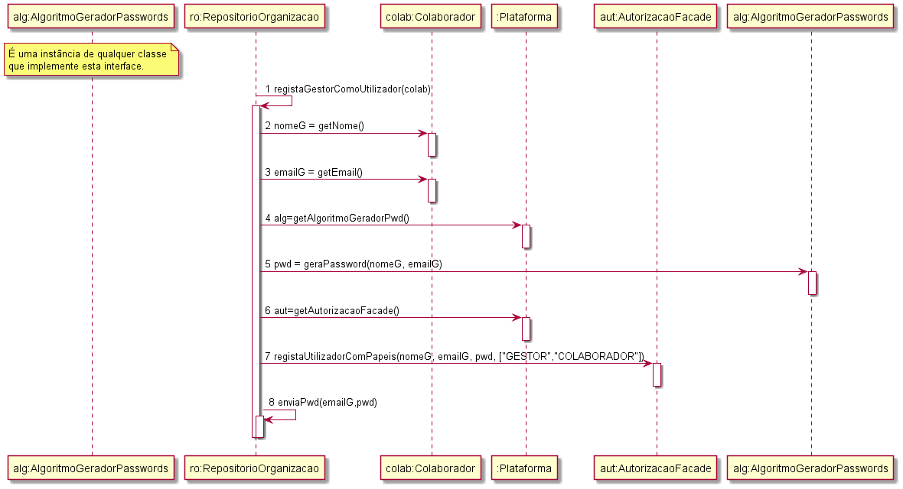
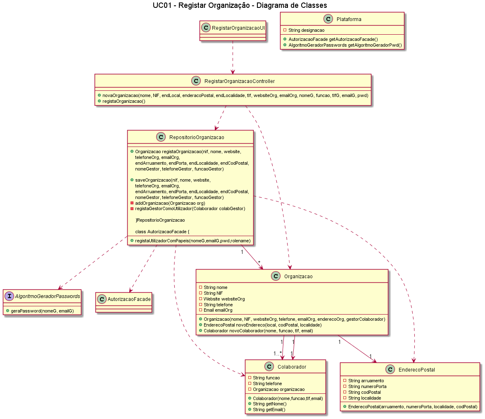
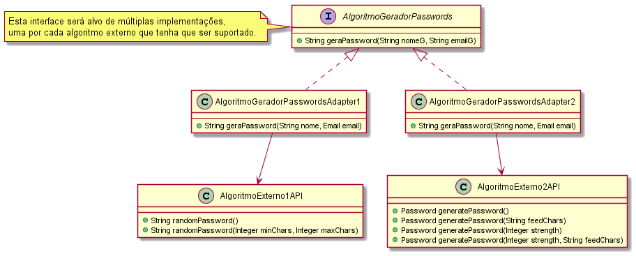

##### [Voltar ao início](https://github.com/blestonbandeiraUPSKILL/upskill_java1_labprg_grupo2/tree/main/README.md)

# UC01 - Registar Organização

## Formato Breve

O utilizador não registado inicia o registo de uma organização. O sistema solicita os dados necessários sobre a organização (i.e. nome da organização, o NIF, o endereço postal, um contacto telefónico, o endereço web, email) e sobre o colaborador (i.e. gestor) que está a proceder ao registo (i.e. nome, função, contacto telefónico e email). O utilizador não registado introduz os dados solicitados. O sistema valida regista os dados da organização e do seu colaborador/gestor, tornando este último um utilizador registado, mostrando-lhe a sua palavra-passe (gerada pelo sistema) e informa o utilizador não registado do sucesso da operação.

## Formato Completo

**_Ator Primário:_**

- Colaborador/Gestor da Organização

**_Partes interessadas e seus interesses:_**

- Organização: pretende ficar registada na plataforma
- T4J: pretende que as organizações se registem

**_Pré-condições:_**

* A plataforma tem de permitir o registo de organizações
* A plataforma tem de conseguir gerar passwords aleatórias

**_Pós-condições_**

- A organização fica registada na plataforma

**_Cenário de sucesso principal:_**

1. O colaborador inicia o registo de organização.
2. O sistema solicita os dados necessários da organização (nome, NIPC, Endereço, Telefone, Email, website) e do colaborador, que assumirá o papel de gestor, (nome, telefone, email, função)).
3. O colaborador/gestor introduz os dados solicitados.
4. O sistema regista os dados.
5. O sistema gera a password do colaborador/gestor e mostra-a.
6. O sistema informa o colaborador/gestor do sucesso da operação.

**_Fluxos Alternativos:_**

1. O colaborador solicita o cancelamento do registo da organização. O caso de uso termina.
2. Dados mínimos obrigatórios em falta:  
  a. O sistema informa quais os dados em falta.  
  b. O sistema permite a introdução dos dados em falta.  
  c. O colaborador não insere os dados. O caso de uso termina.
3. O sistema deteta que os dados (ou algum subconjunto dos dados) introduzidos devem ser únicos e que já existem no sistema: 
  a. O sistema alerta o colaborador para o facto. 
  b. O sistema permite a sua alteração. 
  c. O colaborador não altera os dados. O caso de uso termina.

## Diagrama de Sequência do Sistema  

## Excerto do Modelo de Domínio  

## Diagrama de Sequência  

## Diagrama de Classes  

## Plano de Testes  
[UC01 - Registar Organização - Plano de Testes](UC01_Registar_Organizacao_Plano_Testes.md)

##### [Voltar ao início](https://github.com/blestonbandeiraUPSKILL/upskill_java1_labprg_grupo2/tree/main/README.md)
