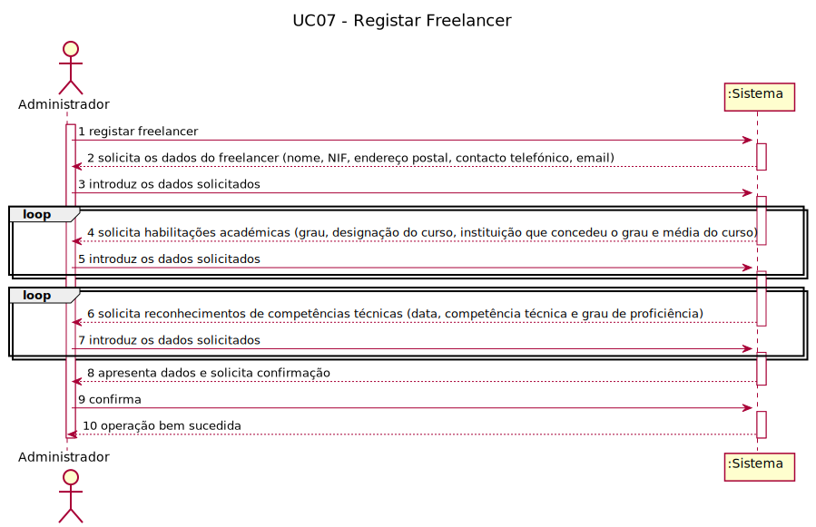
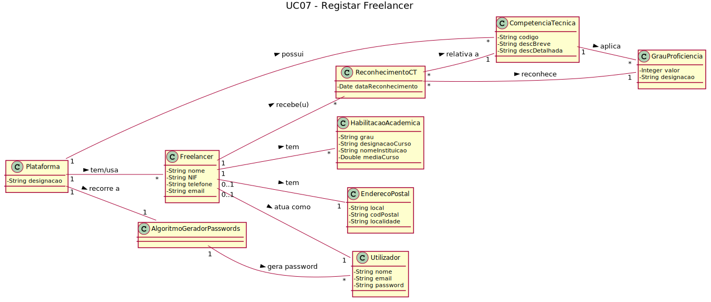
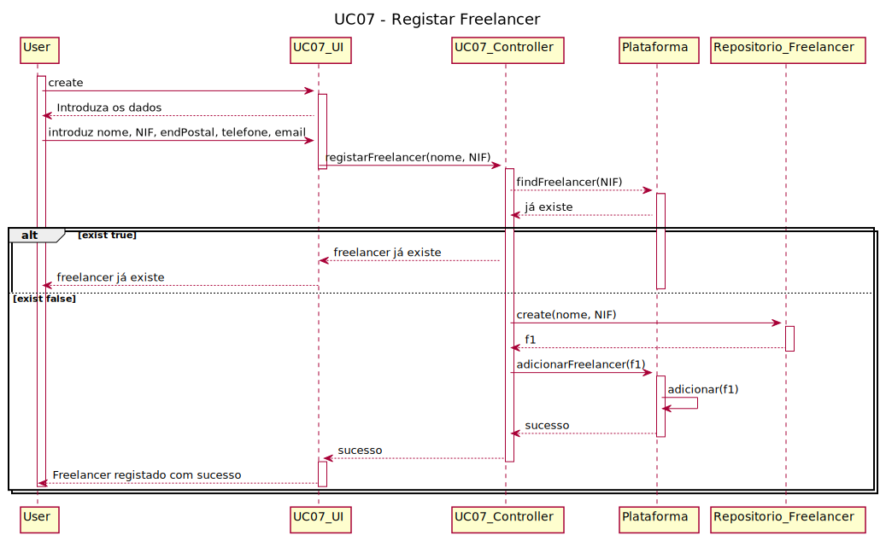

# UC7 - Registo de Freelancer

## 1. Engenharia de Requisitos

### Formato Breve

O Administrativo inicia o registo de um freelancer. O Sistema solicita os dados que caracterizam o freelancer (i.e., o nome, o NIF, o endereço postal, um contacto telefónico e email). O administrativo introduz os dados solicitados. O Sistema regista os dados do freelancer, gera a password, mostrando-a ao administrativo e um utilizador registado estes dados. O administrativo toma nota da password para a enviar ao freelancer. 
Depois do registo inicial, o administrativo introduz as habilitações académicas (grau, designação do curso, instituição que concedeu o grau e média do curso). O sistema informa o Administrativo do sucesso da operação.
O administrativo introduz os reconhecimentos de competências técnicas (data, competência técnica, grau de proficiência) que lhe foram atribuídos. O sistema informa o Administrativo do sucesso da operação.

### Formato Completo

#### Ator principal

Administrativo

#### Partes interessadas e seus interesses

* **Administrativo:** pretende registar um Freelancer na Plataforma.
* **Freelancer:** Pretende aceder à Plataforma para que lhe possam ser atribuidas tarefas.
* **T4J:** pretende que a Plataforma possua Freelancers para que estes comecem a trabalhar nas tarefas propostas.

#### Pré-condições

O Administrativo possui todos os dados obrigatórios para poder registar o Freelancer na Plataforma.

#### Pós-condições
O Freelancer fica registado na Plataforma.

#### Cenário de sucesso principal (ou fluxo básico)

1. O Administrativo inicia o processo de registo de um Freelancer na Plataforma.
2. O Sistema solicita os dados  do freelancer (nome, NIF, endereço postal, contacto telefónico, email).
3. O Administrativo introduz os dados solicitados.
4. O Sistema solicita habilitações académicas (grau, designação do curso, instituição que concedeu o grau e média do curso).
5. O Administrativo introduz os dados solicitados.
**Os passos 4 a 5 repetem-se enquanto não forem introduzidas todos os dados pedidos**
6. O Sistema solicita reconhecimentos de competências técnicas (data, competência técnica e grau de proficiência).
7. O Administrativo introduz os dados solicitados.
**Os passos 6 a 7 repetem-se enquanto não forem introduzidas todos os dados pedidos**
8. O Sistema apresenta dados e solicita confirmação.
9. O administrador confirma os dados inseridos.
10. O Sistema informa que a operação foi bem sucedida.

#### Extensões (ou fluxos alternativos)

*A. O Administrativo solicita o cancelamento do registo de Freelancer.
> O caso de uso termina.

*B. O Administrativo não possui dados obrigatórios sobre as habilitações académicas do Freelancer.
> 1. O Sistema informa ao Administrativo que dados estão em falta.  
> 2. O Administrativo não introduz os dados em falta.
> O caso de uso termina.

*C. O Administrativo não possui dados obrigatórios sobre o reconhecimento das competências técnicas do Freelancer.
> 1. O Sistema informa ao Administrativo que dados estão em falta.  
> 2. O Administrativo não introduz os dados em falta.
> O caso de uso termina.

*D. O Administrativo não confirma os dados inseridos no final da operação.
> 1. O Sistema informa que a operação não foi bem sucedida.
> O caso de uso termina.

## 2. Análise OO

### Diagrama de Sequência de Sistema

### Excerto do Modelo de Domínio Relevante para o UC

###	Diagrama de Sequência

###	Diagrama de Classes

