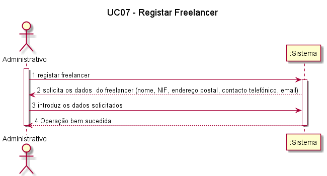
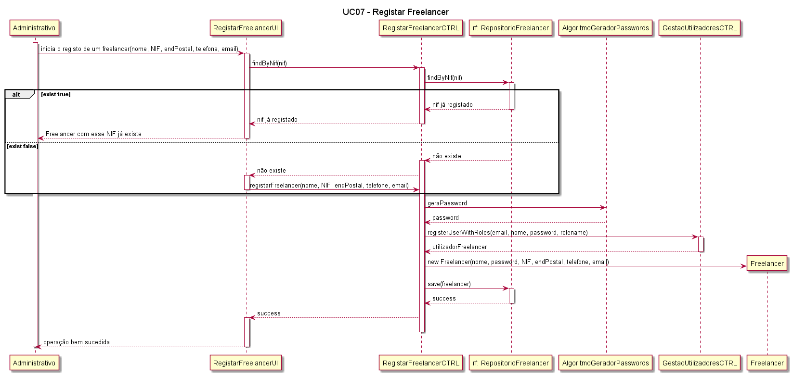
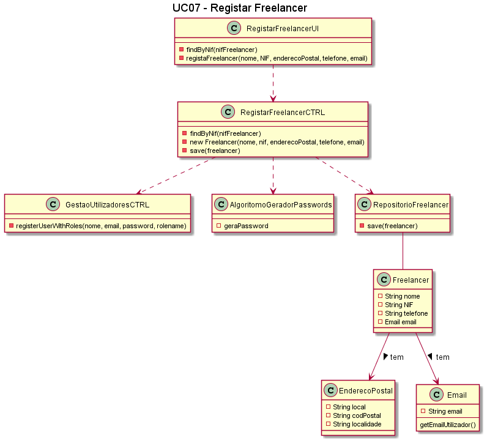

##### [Voltar ao início](https://github.com/blestonbandeiraUPSKILL/upskill_java1_labprg_grupo2/tree/main/README.md)

# UC7 - Registo de Freelancer

## Formato Breve

O Administrativo inicia o registo de um freelancer. O Sistema solicita os dados que caracterizam o freelancer (i.e., o nome, o NIF, o endereço postal, um contacto telefónico e email). O administrativo introduz os dados solicitados. O Sistema regista os dados do freelancer, gera a password, mostrando-a ao administrativo. O administrativo toma nota da password para a enviar ao freelancer. 
Depois do registo inicial, o administrativo introduz as habilitações académicas (grau, designação do curso, instituição que concedeu o grau e média do curso). O sistema informa o Administrativo do sucesso da operação.
O administrativo introduz os reconhecimentos de competências técnicas (data, competência técnica, grau de proficiência) que lhe foram atribuídos. O sistema informa o Administrativo do sucesso da operação.

## Formato Completo

**_Ator Primário:_**

- Administrativo

**_Partes interessadas e seus interesses:_**

- Administrativo: pretende registar um Freelancer na Plataforma.
- Freelancer: Pretende aceder à Plataforma para que lhe possam ser atribuidas tarefas.
- T4J: pretende que a Plataforma possua Freelancers para que estes comecem a trabalhar nas tarefas propostas.

**_Pré-condições:_**

- O Administrativo possui todos os dados obrigatórios para poder registar o Freelancer na Plataforma.

**_Pós-condições_**

O Freelancer fica registado na Plataforma.

**_Cenário de sucesso principal:_**

1. O Administrativo inicia o processo de registo de um Freelancer na Plataforma.
2. O Sistema solicita os dados do freelancer (nome, NIF, endereço postal, contacto telefónico, email).
3. O Administrativo introduz os dados solicitados.
4. O Sistema regista o freelancer e apresenta mensagem de sucesso.
5. O Administrativo inicia o processo de introdução dos dados de habilitações académicas (grau, designação do curso, instituição que concedeu o grau e média do curso).
6. O Sistema regista as habilitações académicas do freelancer e apresenta mensagem de sucesso. 
7. O Administrativo inicia o processo de introdução dos dados de reconhecimento das competências técnicas(data, competência técnica e grau de proficiência).
8. O Sistema regista os reconhecimento das competências técninicas e apresenta mensagem de sucesso.

**_Fluxos Alternativos:_**
1. O Administrativo solicita o cancelamento do registo de Freelancer.  
    a. O caso de uso termina.
2. Dados mínimos obrigatórios em falta:  
  a. O sistema informa quais os dados em falta.  
  b. O sistema permite a introdução dos dados em falta.  
  c. O administrativo não insere os dados. O caso de uso termina.
3. O sistema deteta que os dados (ou algum subconjunto dos dados) introduzidos devem ser únicos e que já existem no sistema: 
  a. O sistema alerta o administrativo para o facto. 
  b. O sistema permite a sua alteração. 
  c. O administrativo não altera os dados. O caso de uso termina.

## Diagrama de Sequência de Sistema

## Excerto do Modelo de Domínio

##	Diagrama de Sequência

##	Diagrama de Classes

## Plano de Testes  
[UC07 - Registar Freelancer - Plano de Testes](UC07_Registar_Freelancer_Plano_Testes.md)

##### [Voltar ao início](https://github.com/blestonbandeiraUPSKILL/upskill_java1_labprg_grupo2/tree/main/README.md)