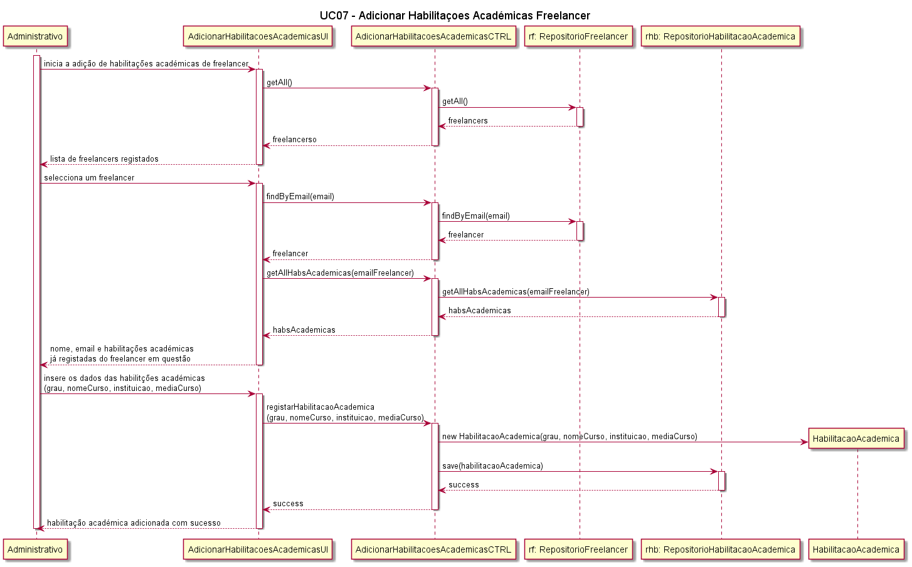

##### [Voltar ao início](https://github.com/blestonbandeiraUPSKILL/upskill_java1_labprg_grupo2/tree/main/README.md)

# UC07a - Adicionar Habilitações Académicas

## Formato Breve

O administrativo inicia o processo de inserção das habilitações académicas de freelancer. O sistema apresenta uma lista dos freelancers registados. O administrativo selecciona o freelancer a que pretende adicionar as habilitações académicas, preenchendo os campos disponibilizados: grau, designação do curso, instituição que concedeu o grau e média do curso. O administrativo conclui o processo e o sistema informa-o do sucesso da operação.

## Formato Completo

**_Ator Primário:_**

- Administrativo

**_Partes interessadas e seus interesses:_**

- Administrativo: pretende adicionar as habilitações académicas de um Freelancer registado na Plataforma.
- Freelancer: Pretende que as suas habilitações sejam adicionadas para que os colaboradores os possam conhecer um pouco e lhes possam atribuir tarefas.
- T4J: pretende que a Plataforma possua Freelancers habilitados para que estes comecem a trabalhar nas tarefas propostas.

**_Pré-condições:_**

- O Administrativo tem de estar registado na Plataforma.
- O Freelancer tem de estar registado na Plataforma.
- As habilitações académicas do Freelancer têm de ter sido validadas por uma entidade competente.

**_Pós-condições_**

- O Freelancer passa a ter habilitações académicas atribuídas.

**_Cenário de sucesso principal:_**

1. O Administrativo inicia o processo de introdução dos dados de habilitações académicas.
2. O Administrativo selecciona um Freelancer a partir da lista de Freelancers registados.
3. O sistema permite a inserção dos dados necessários: grau, designação do curso, instituição que concedeu o grau e média do curso.
4. O Sistema regista as habilitações académicas do freelancer e apresenta mensagem de sucesso. 

**_Fluxos Alternativos:_**

1. O Administrativo solicita o cancelamento da inserção de habilitações académicas de Freelancer.  
    a. O caso de uso termina.
2. Dados mínimos obrigatórios em falta:  
  a. O sistema informa quais os dados em falta.  
  b. O sistema permite a introdução dos dados em falta (passo 3).  
  c. O administrativo não insere os dados. O caso de uso termina.
3. O sistema deteta que os dados (ou algum subconjunto dos dados) introduzidos devem ser únicos e que já existem no sistema: 
  a. O sistema alerta o administrativo para o facto. 
  b. O sistema permite a sua alteração (passo 3). 
  c. O administrativo não altera os dados. O caso de uso termina.

## Diagrama de Sequência do Sistema

## Excerto do Modelo de Domínio

## Diagrama de Sequência  

## Diagrama de Classes  

## Plano de Testes  

##### [Voltar ao início](https://github.com/blestonbandeiraUPSKILL/upskill_java1_labprg_grupo2/tree/main/README.md)

