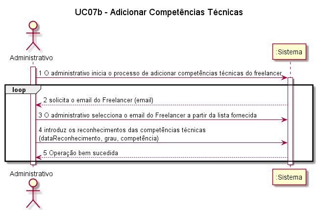
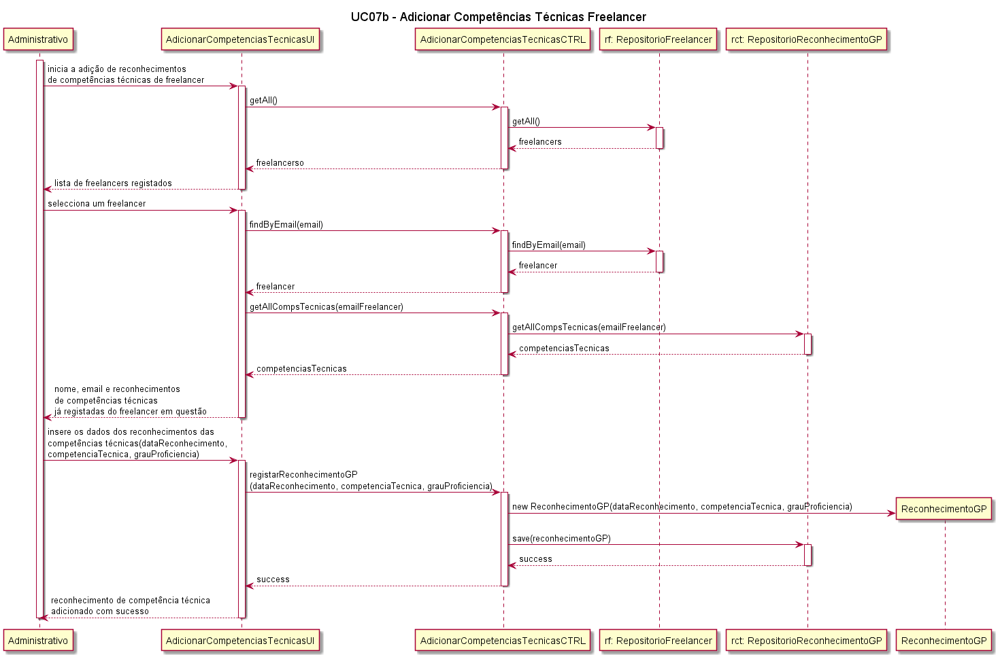

##### [Voltar ao início](https://github.com/blestonbandeiraUPSKILL/upskill_java1_labprg_grupo2/tree/main/README.md)

# UC07b - Adicionar Competências Técnicas

## Formato Breve

O administrativo inicia o processo de inserção dos reconhecimentos de competências técnicas de freelancer. O sistema apresenta uma lista dos freelancers registados. O administrativo selecciona o freelancer a que pretende adicionar os reconhecimentos, preenchendo os campos disponibilizados: data do reconhecimento, competência técnica reconhecida e respectivo grau de proficiência. O administrativo conclui o processo e o sistema informa-o do sucesso da operação.

## Formato Completo

**_Ator Primário:_**

- Administrativo

**_Partes interessadas e seus interesses:_**

- Administrativo: pretende adicionar os reconhecimentos de competências técnicas de um Freelancer registado na Plataforma.
- Freelancer: Pretende que os seus os reconhecimentos de competências técnicas sejam adicionados para que os colaboradores lhes possam atribuir tarefas.
- T4J: pretende que a Plataforma possua Freelancers com competências técnicas validadeas para que estes comecem a trabalhar nas tarefas propostas.

**_Pré-condições:_**

- O Administrativo tem de estar registado na Plataforma.
- O Freelancer tem de estar registado na Plataforma.
- Os reconhecimentos de competências técnicas do Freelancer têm de ter sido feitos por uma entidade competente.

**_Pós-condições_**

- O Freelancer passa a ter os reconhecimentos de competências técnicas atribuídos.

**_Cenário de sucesso principal:_**

1. O Administrativo inicia o processo de introdução dos dados de reconhecimento das competências técnicas.
2. O Administrativo selecciona um Freelancer a partir da lista de Freelancers registados.
3. O sistema permite a inserção dos dados necessários: data do reconhecimento, competência técnica e respectivo grau de proficiência.
4. O Sistema regista os reconhecimento das competências técninicas e apresenta mensagem de sucesso.

**_Fluxos Alternativos:_**

1. O Administrativo solicita o cancelamento da inserção de reconhecimentos de competências técnicas de Freelancer.  
    a. O caso de uso termina.
2. Dados mínimos obrigatórios em falta:  
  a. O sistema informa quais os dados em falta.  
  b. O sistema permite a introdução dos dados em falta (passo 3).  
  c. O administrativo não insere os dados. O caso de uso termina.
3. O sistema deteta que os dados (ou algum subconjunto dos dados) introduzidos devem ser únicos e que já existem no sistema: 
  a. O sistema alerta o administrativo para o facto. 
  b. O sistema permite a sua alteração (passo 3). 
  c. O administrativo não altera os dados. O caso de uso termina.

## Diagrama de Sequência do Sistema

## Excerto do Modelo de Domínio

## Diagrama de Sequência  

## Diagrama de Classes  

## Plano de Testes  

##### [Voltar ao início](https://github.com/blestonbandeiraUPSKILL/upskill_java1_labprg_grupo2/tree/main/README.md)

