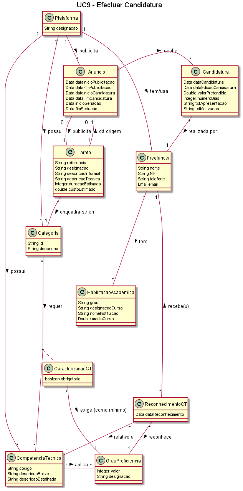

##### [Voltar ao início](https://github.com/blestonbandeiraUPSKILL/upskill_java1_labprg_grupo2/blob/main/README.md)

# UC9 - Efectuar Candidatura

## Formato Breve

O Freelancer inicia a candidatura a um anúncio. O sistema solicita a escolha do anúncio duma
lista de anúncios em período de candidatura e para os quais o Freelancer está elegível. O
Freelancer identifica o anúncio para o qual pretende apresentar uma candidatura. O sistema
solicita os dados necessários para a candidatura ao anúncio (i.e. valor pretendido, numero
dias, texto apresentação (opcional), texto motivação (opcional)). O Freelancer introduz os
dados solicitados. O sistema valida e apresenta os dados ao Freelancer e pede a sua
confirmação. O Freelancer confirma os dados. O sistema regista uma nova candidatura ao
anúncio e informa o Freelancer do sucesso da operação.

## Formato Completo

**_Ator Primário:_**

- Freelancer

**_Partes interessadas e seus interesses:_**

- Plataforma: Pretende que os Freelancers se candidatem a tarefas
- Organização: Pretende ter Freelancers candidatos às suas tarefas;
- Freelancers: Pretendem candidatar-se a tarefas.

**_Pré-condições:_**

- O Freelancer deve estar registado na plataforma;
- Devem existir tarefas publicadas em período de candidatura;
- O Freelancer deve ter login válido.
- O Freelancer deve ter grau de proficiência igual ou superior ao mínimo definido nas competências técnicas obrigatórias.

**_Pós-condições_**

- O Freelancer candidatou-se a uma dada tarefa com sucesso;
- O Freelancer consta na lista de Freelancers que irá passar pelo processo de seriação.

**_Cenário de sucesso principal:_**

1. O Freelancer inicia a candidatura a um anúncio;
2. O sistema solicita a escolha de um anúncio legível;
3. O Freelancer selecciona um anúncio para registar candidatura;
4. O sistema solicita os dados para a candidatura; 
5. O Freelancer introduz os dados solicitados;
6. O sistema apresenta os dados e solicita confirmação;
7. O Freelancer confirma os dados;
8. O Sistema regista a nova candidatura e informa do sucesso da operação.

**_Fluxos Alternativos:_**

1. O Freelancer cancela o processo de efectuar candidatura. 
    a. O caso de uso termina.
2. O Freelancer verifica que não existem anúncios elegíveis. 
    a. O caso de uso termina.
3. O Freelancer introduz dados inválidos:    
    a. O sistema permite a correção dos dados introduzidos (Passo 3). 
    b. O Freelancer não altera os dados. 
    c. O caso de uso termina.
4. O sistema deteta que o Freelancer já consta na lista de candidaturas àquela tarefa
    a. O sistema alerta o Freelancer para o facto.
    b. O caso de uso termina.

    ## Diagrama de Sequência de Sistema 

## Excerto do Modelo de Domínio 

## Diagrama de sequência  

## Diagrama de Classes  

## Plano de Testes  

[UC9_Plano_Testes](UC9_Plano_testes.md)

##### [Voltar ao início](https://github.com/blestonbandeiraUPSKILL/upskill_java1_labprg_grupo2/blob/main/README.md)