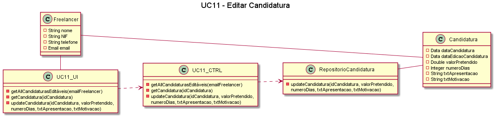

##### [Voltar ao início](https://github.com/blestonbandeiraUPSKILL/upskill_java1_labprg_grupo2/tree/main/README.md)

# UC11 - Editar Candidatura

## Formato Breve

O Freelancer acede ao sistema e consulta as suas candidaturas válidas. O sistema informa ao Freelancer o status das suas Candidaturas válidas, a saber: 
1. Candidatura em período de submissão/edição.
2. Candidatura em período de seriação.
3. Candidaturas expiradas.
O sistema disponibiliza ao Freelancer a edição somente das candidaturas em período de submissão/edição. O Freelancer seleciona a candidatura que deseja editar. O sistema apresenta os dados já registados para a candidatura ao anúncio e permite que o freelancer altere os dados (i.e. valor pretendido, número de dias, texto apresentação, texto motivação). O Freelancer introduz ou mantém os dados já preenchidos. O sistema atualiza os dados da candidatura ao anúncio, inclui a data de edição e informa ao Freelancer do sucesso da operação.

## Formato Completo

**_Ator Primário:_**

- Freelancer

**_Partes interessadas e seus interesses:_**

- T4J: Pretende que os Freelancers se candidatem a tarefas
- Organização: Pretende ter Freelancers candidatos às suas tarefas;
- Freelancers: Pretendem editar suas candidatura às tarefas.

**_Pré-condições:_**

- O Freelancer deve estar registado na plataforma;
- O Freelancer deve ter ao menos uma candidatura a uma tarefa publicada por uma dada organização;
- A tarefa para a qual o Freelancer deseja editar os dados deve estar ainda em período válido de candidaturas.

**_Pós-condições_**

- O Freelancer edita a sua candidatura a uma dada tarefa com sucesso;
- O Freelancer consta na lista de Freelancers que passarão pelo processo de seriação.

**_Cenário de sucesso principal:_**

1. O Freelancer acede ao sistema e verifica as candidaturas efetuadas que ainda se encontram em período de submissão/edição;
2. O Freelancer selecciona uma candidatura a editar;
4. O sistema mostra os dados registados para a candidatura e possibilita edição; 
5. O Freelancer mantém ou modifica os dados existentes;
6. O Sistema atualiza os dados da candidatura, inclui a data de edição e informa do sucesso da operação.

### Fluxos alternativos

1. O Freelancer cancela o processo de edição da candidatura. 
   a. O caso de uso termina.
2. O Freelancer verifica que não existem candidaturas em período de submissão/edição. 
   a. O caso de uso termina.
3. O Freelancer introduz dados inválidos:    
   a. O sistema permite a correção dos dados introduzidos (Passo 3).
   b. O Freelancer não altera os dados. 
   c. O caso de uso termina.

## Diagrama de Sequência do Sistema

## Excerto do Modelo de Domínio

## Diagrama de sequência  

## Diagrama de Classes  

## Plano de Testes  

##### [Voltar ao início](https://github.com/blestonbandeiraUPSKILL/upskill_java1_labprg_grupo2/tree/main/README.md)
