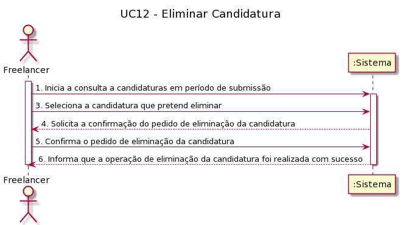
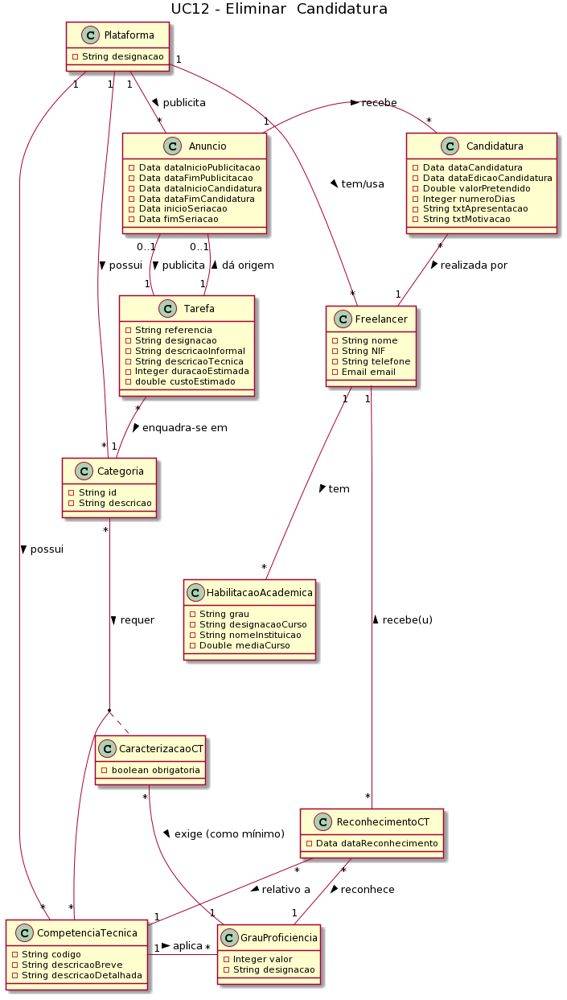
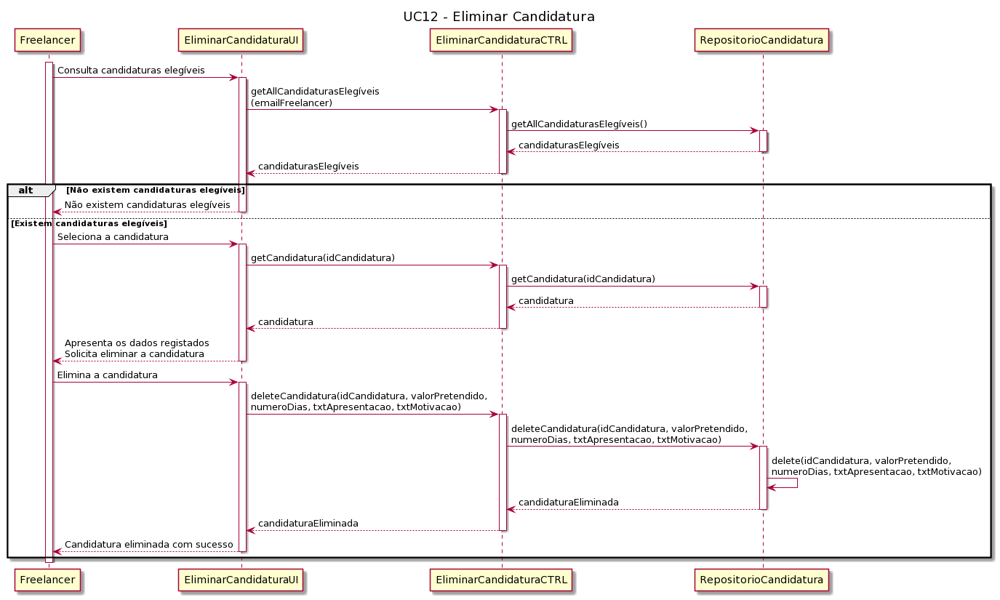
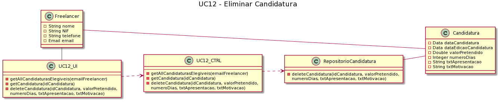

##### [Voltar ao início](https://github.com/blestonbandeiraUPSKILL/upskill_java1_labprg_grupo2/tree/main/README.md)

# UC12 - Eliminar Candidatura

## Formato Breve

O Freelancer efetua o login no sistema. O Freelancer pede para consultar as suas candidaturas e solicita a eliminação de uma delas. O Sistema solicita a confirmação deste pedido. O Freelancer confirma e o Sistema procede à eliminação da candidatura em questão. O Sistema informa que o procedimento foi realizado com sucesso.

## Formato Completo

**_Ator Primário:_**

- Freelancer

**_Partes interessadas e seus interesses:_**

- Freelancers: Pretendem eliminar candidaturas que tenham efetuado.

**_Pré-condições:_**

- O Freelancer deve estar registado no Sistema;
- O Freelancer deve ter candidaturas a tarefas ainda válidas.

**_Pós-condições_**

- O Freelancer elimina candidaturas que tenha efetuado.

**_Cenário de sucesso principal:_**

1. O Freelancer efetua o login no sistema;
2. O Freelancer pede para consultar as suas candidaturas a anúncios;
3. O Freelancer solicita a eliminação de uma das suas candidaturas;
4. O Sistema solicita a confirmação deste pedido;
5. O Freelancer confirma o seu pedido;
6. O Sistema procede à eliminação da candidatura em questão;
7. O Sistema informa que o procedimento foi realizado com sucesso.

### Fluxos alternativos

A)
1. O Freelancer não consegue efetuar com suscesso o login no Sistema.
-> O caso de uso termina.

B)
1. O Freelancer efetua o login no sistema;
2. O Freelancer pede para consultar as suas candidaturas a anúncios;
3. O Freelancer solicita a eliminação de uma das suas candidaturas;
4. O Sistema solicita a confirmação deste pedido;
5. O Freelancer não confirma o seu pedido.
-> O caso de uso termina.

## Diagrama de Sequência do Sistema

## Excerto do Modelo de Domínio

## Diagrama de sequência  

## Diagrama de Classes  

## Plano de Testes  
[UC12 - Eliminar Candidatura - Plano de Testes](UC12.md)

##### [Voltar ao início](https://github.com/blestonbandeiraUPSKILL/upskill_java1_labprg_grupo2/tree/main/README.md)