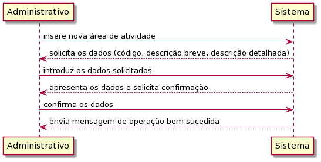
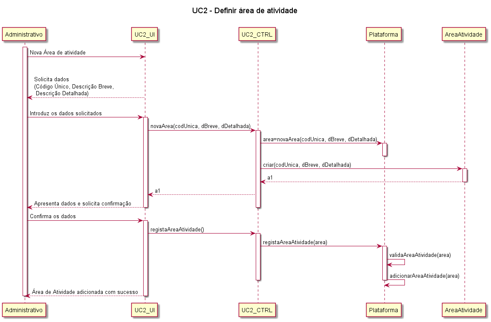
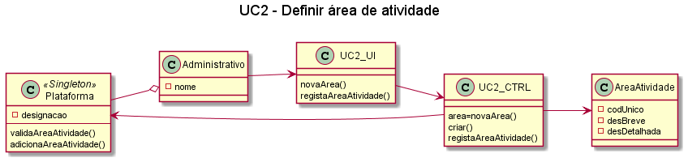

# UC2 – Definir Área de Actividade  

## Formato Breve  
O administrador inicia a definição de uma nova área de actividade. O sistema solicita os dados necessários (código único, descrição breve e descrição detalhada). O administrador introduz os dados solicitados. O sistema valida e apresenta os dados ao administrado, pedindo que os confirme. O administrativo confirma. O sistema regista os dados e informa o administrado do sucesso da operação.

## Formato Completo  
### Ator primário
Administrativo
### Partes interessadas e seus interesses  
Administrativo: pretende definir as áreas de atividade para que possa posteriormente catalogar as competências técnicas e categorias de tarefas.
T4J: pretende que a plataforma permita catalogar as competências técnicas e as categorias de tarefas em áreas de atividade.
### Pré-condições 
O administrativo tem de estar registado na plataforma.
### Pós-condições 
A informação da área de atividade é registada no sistema.
### Cenário de sucesso principal 
1.	O administrativo inicia a definição de uma nova área de atividade.
2.	O sistema solicita os dados necessários (código único e descrição breve e detalhada).
3.	O administrativo introduz os dados solicitados.
4.	O sistema valida e apresenta os dados ao administrativo, pedindo que os confirme.
5.	O administrativo confirma.
6.	O sistema regista os dados e informa o administrativo do sucesso da operação.
### Extensões (ou fluxos alternativos) 
1.	O administrativo solicita o cancelamento da definição da área de atividade. O caso de uso termina.
2.	Dados mínimos obrigatórios em falta:
a.	O sistema informa quais os dados em falta.
b.	O sistema permite a introdução dos dados em falta (passo 3).
c.	O administrativo não altera os dados. O caso de uso termina.
3.	O sistema deteta que os dados (ou algum subconjunto dos dados) introduzidos devem ser únicos e que já existem no sistema:
a.	O sistema alerta o gestor para o facto.
b.	O sistema permite a sua alteração (passo 3).
c.	O administrativo não altera os dados. O caso de uso termina.

## Diagrama de sequência de Sistema (SSD) 

## Diagrama de sequência 

## Diagrama de classes 

##### [Voltar ao início](https://github.com/ajorgesantosp/upskill_java1_g1/blob/main/README.md)