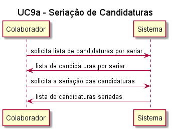
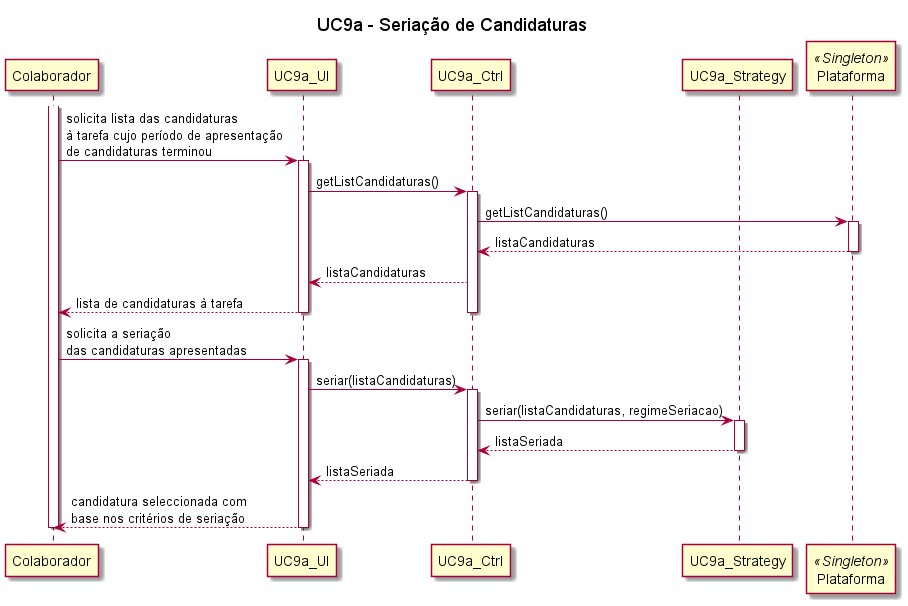
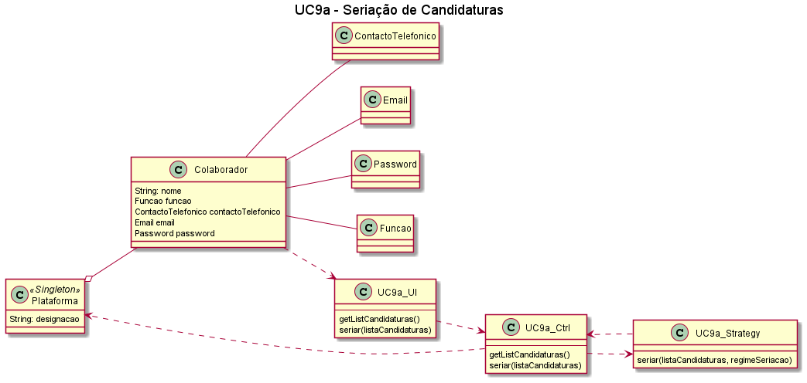

# UC9a – Seriação de Candidaturas

## Formato breve
Aquando da publicação da tarefa, o colaborador da organização determina qual o regime de seriação das candidaturas, de entre as seguintes opções: 
i)	Seriação subjectiva com atribuição opcional (o processo de seriação assenta em critérios subjectivos definidos pela organização e esta não está obrigada a atribuir a tarefa a nenhum dos candidatos);
ii)	Seriação subjectiva com atribuição obrigatória (o processo de seriação assenta em critérios subjectivos definidos pela organização, e esta está a obrigada a atribuir a tarefa a um dos candidato);
iii)	Seriação automática.
Findo o período de publicitação de apresentação de candidaturas pelo freelancer, o sistema inicia o período de seriação e atribuição da tarefa a um freelancer. De acordo com o regime seleccionado pela organização, o sistema procede à seriação das candidaturas e apresenta a candidatura seleccionada ao colaborador.

## Formato completo
### Actor primário
* Colaborador da organização.

### Partes interessadas e seus interesses
* T4J: pretende que a plataforma seleccione candidaturas para a realização de tarefas publicadas pelas organizações.
* Organização: pretende estabelecer critérios que vão ao encontro das necessidades de cada tarefa.

### Pré-condições
1.	O colaborador da organização tem de estar registado na plataforma.
2.	A tarefa tem de estar publicada.
3.	O período de apresentação de candidaturas tem de ter terminado.
4.	O período de seriação e adjudicação das tarefas tem de ter iniciado.
5.	As candidaturas à tarefa não podem ainda ter sido seriadas.
6.	A tarefa não pode ainda ter sido adjudicada.
7.	Tem de existir pelo menos uma candidatura à oferta supra indicada.

### Pós-condições
As candidaturas à tarefa são seriadas de acordo com o regime pré-estabelecido pelo colaborador da organização.

*Cenário de sucesso principal:*
1.	O colaborador da organização consulta a lista de tarefas publicadas e por adjudicar. 
2.	O colaborador da organização solicita ao sistema a seriação das candidaturas. 
a.	No caso de seriação subjectiva com atribuição opcional, se não houver nenhuma candidatura que preencha os critérios definidos, não é seleccionada nenhuma candidatura.
b.	No caso de seriação subjectiva com atribuição obrigatória, o colaborador selecciona um freelancer, que cumpra os requisitos definidos pela organização, para a realização da tarefa.
c.	No caso de atribuição automática, o sistema atribui a tarefa ao freelancer que tenha apresentado o segundo preço mais baixo.
3.	O sistema procede à serição das candidaturas e apresenta ao colaborador da organização uma candidatura correspondente aos critérios seleccionados.

### Fluxos alternativos:
1.	O colaborador cancela a seriação da tarefa.
a.	O caso de uso termina.
2.	O sistema detecta que não existem tarefas publicadas por adjudicar.
a.	O caso de uso termina.
3.	O sistema detecta que não existem tarefas publicadas.
a.	O caso de uso termina.
4.	O sistema detecta que a tarefa cujas candidaturas o colaborador pretende seriar ainda se encontra no período de apresentação de candidaturas.
a.	O caso de uso termina.
5.	O sistema detecta que a tarefa ainda não se encontra no período de seriação e adjudicação de tarefas, ou que esse período já expirou.
a.	O caso de uso termina.

#### SSD

#### Diagrama de Sequência

#### Diagrama de Classes

##### [Voltar ao início](https://github.com/ajorgesantosp/upskill_java1_g1/blob/main/README.md)
