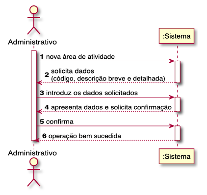
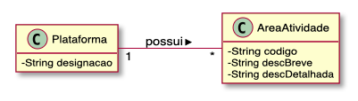
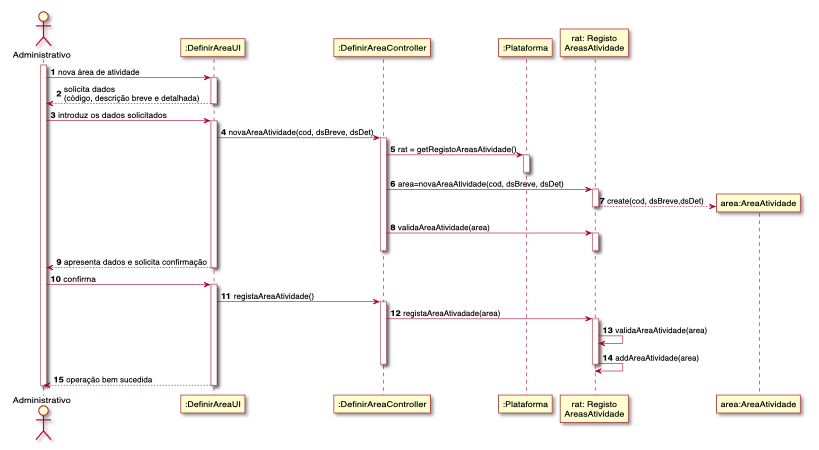

# UC03 - DEFINIR CATEGORIA DE TAREFA

## Diagrama de Sequência de Sistema

## Excerto do Modelo do Domínio

## Diagrama de Sequência

##### [Voltar ao Enunciado](https://github.com/blestonbandeiraUPSKILL/upskill_java1_labprg_grupo2/blob/main/Sprint%202%20-%20Documenta%C3%A7%C3%A3o/Enunciado/Enunciado.md)