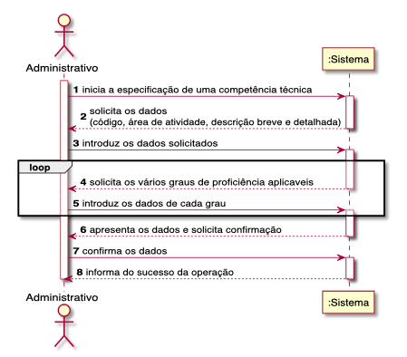
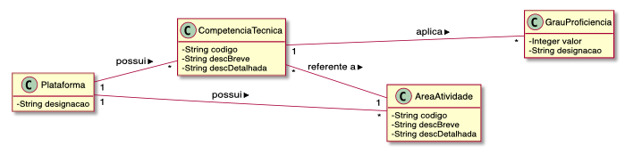
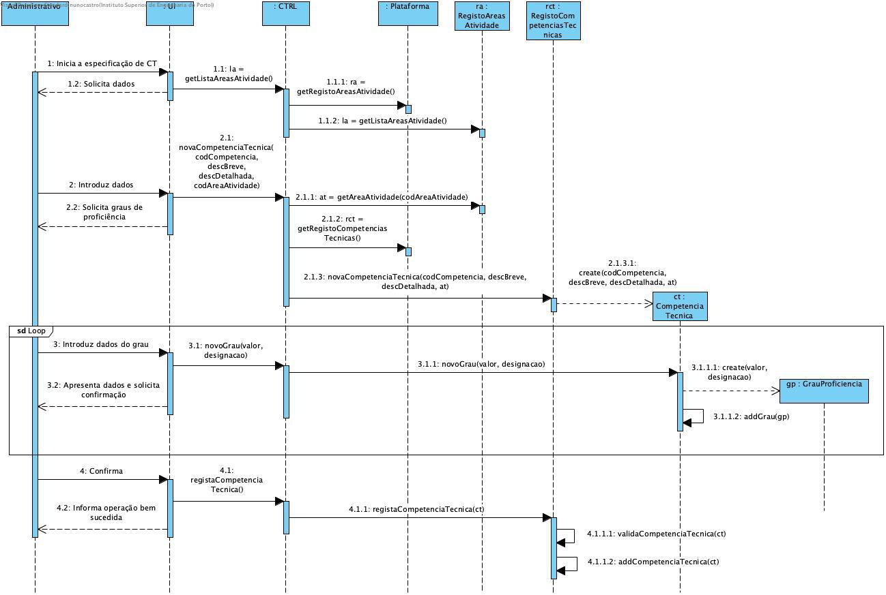

# UC04 - ESPECIFICAR COMPETÊNCIA TÉCNICA

O administrativo inicia a especificação de uma competência técnica. O sistema solicita os dados necessários (i.e. código único, área de atividade e descrição breve e detalhada). O administrativo introduz os dados solicitados. O sistema solicita os vários graus de proficiência aplicáveis a esta CT. O administrativo introduz os dados de cada grau. O sistema valida e apresenta os dados ao administrativo, pedindo que os confirme. O administrativo confirma os dados. O sistema regista os dados e informa o administrativo do sucesso da operação.

## Diagrama de Sequência de Sistema

## Excerto do Modelo do Domínio

## Diagrama de Sequência

##### [Voltar ao Enunciado](https://github.com/blestonbandeiraUPSKILL/upskill_java1_labprg_grupo2/blob/main/Sprint%202%20-%20Documenta%C3%A7%C3%A3o/Enunciado/Enunciado.md)