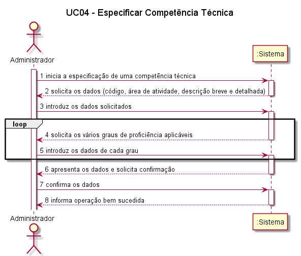
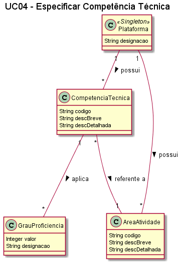
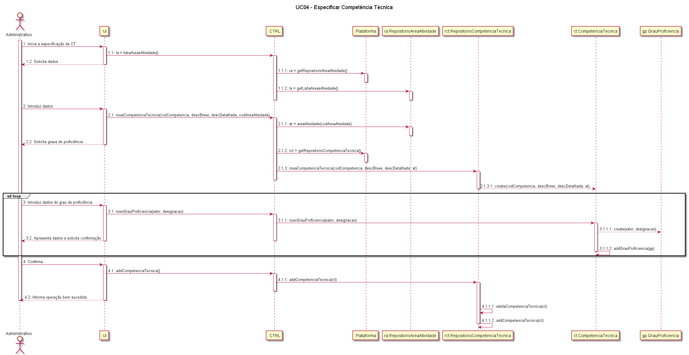
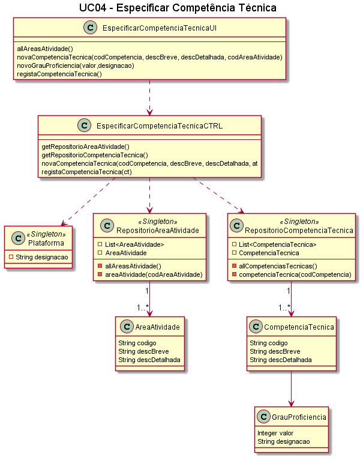

##### [Voltar ao início](https://github.com/blestonbandeiraUPSKILL/upskill_java1_labprg_grupo2/tree/main/README.md)

# UC04 - Especificar Competência Técnica

## Formato Breve

O administrativo inicia a especificação de uma competência técnica. O sistema solicita os dados necessários (i.e. código único, área de atividade e descrição breve e detalhada). O administrativo introduz os dados solicitados. O sistema solicita os vários graus de proficiência aplicáveis a esta CT. O administrativo introduz os dados de cada grau. O sistema valida e apresenta os dados ao administrativo, pedindo que os confirme. O administrativo confirma
os dados. O sistema regista os dados e informa o administrativo do sucesso da operação.

## Formato Completo

**_Ator Primário:_**

- Administrativo

**_Partes interessadas e seus interesses:_**

- Administrativo: Pretende que a competência técnica fique registada na plataforma
- T4J: Pretende ter mais competências técnicas registadas na plataforma
- Freelancer: Pretende ter competências técnicas inseridas na plataforma

**_Pré-condições:_**

- A plataforma tem que ter pelo menos um Administrativo registado.
- É necessário haver pelo menos uma área de atividade inserida na plataforma.

**_Pós-condições_**

- A competência técnica é definida com sucesso, que fica disponível na plataforma.

**_Cenário de sucesso principal:_**

1. O administrativo inicia o processo de definição de uma competência técnica.
2. O sistema solicita os dados.
3. O Administrativo introduz os dados.
4. O sistema solicita a confirmação dos dados.
5. O Administrativo confirma os dados.
6. O sistema devolve mensagem a confirmar o sucesso da operação.

**_Fluxos Alternativos:_**

1. O Administrativo cancela o processo de definir uma competência técnica. 
  a. O caso de uso termina.
2. O Administrativo verifica que não existem mais competências técnicas para definir. 
  a. O caso de uso termina.
3. O Administrativo introduz dados inválidos: 
  a. O sistema permite a correção dos dados introduzidos (Passo 3). 
  b. O Administrativo não altera os dados. 
  c. O caso de uso termina.
4. O sistema deteta que os dados (ou algum subconjunto dos dados) introduzidos devem ser únicos e que já existem no sistema: 
  a. O sistema alerta o gestor para o facto. 
  b. O sistema permite a sua alteração (passo 3). 
  c. O Administrativo não altera os dados. O caso de uso termina.

## Diagrama de Sequência do Sistema

## Excerto do Modelo de Domínio

## Diagrama de sequência  

## Diagrama de Classes  

## Plano de Testes  
[UC04 - Especificar Competência Técnica - Plano de Testes](UC04_Especificar_Competencia_Tecnica_Plano_Testes.md)

##### [Voltar ao início](https://github.com/blestonbandeiraUPSKILL/upskill_java1_labprg_grupo2/tree/main/README.md)
