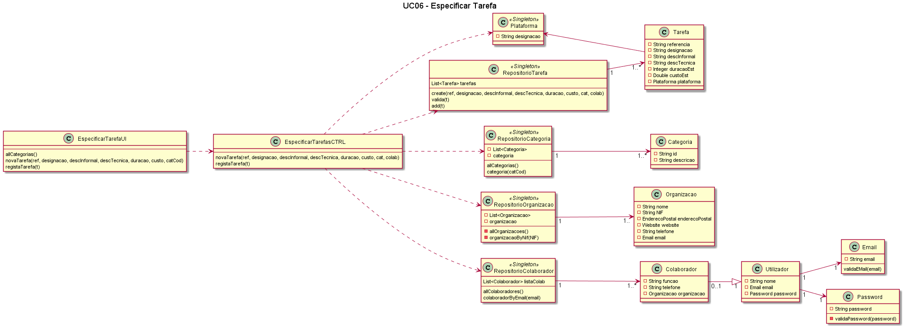

# UC6 - Especificar Tarefa  

## Formato breve   
O Colaborador da organização de organização inicia a especificação de uma tarefa. O sistema solicita os dados necessários (i.e. uma referência única por organização, uma designação, uma descrição informal e outra de carácter técnico, uma estimativa de duração e custo, a categoria). O Colaborador da organização de organização introduz os dados solicitados. O sistema valida e apresenta os dados ao Colaborador da organização de organização, pedindo que os confirme. O Colaborador da organização de organzação confirma. O sistema regista os dados e informa o Colaborador da organização de organização do sucesso da operação.

## Formato completo   

**_Ator Primário:_**

- Colaborador da organização de Organização

**_Partes interessadas e seus interesses:_**

- Colaborador da organização: pretende adicionar uma nova tarefa ao sistema.
- Organização: pretende que as tarefas a realizar sejam introduzidas no sistema.
- T4J: pretende que as organizações e seus Colaborador da organizaçãoes consigam adicionar tarefas ao sistema

**_Pré-condições:_**

- O Colaborador da organização tem de estar registado no sistema como utilizador válido.
- A organização tem de estar registada no sistema.
- Tem de haver categorias de tarefa inseridas no sistema.

**_Pós-condições_**

- O Colaborador da organização regista com sucesso uma nova tarefa.

**_Cenário de sucesso principal:_**
1. O Colaborador da organização inicia a especificação de uma tarefa.
2. O sistema solicita os dados necessários - referência única por organização, designação, descrição informal, descrição técnica, estimativa de duração, custo, categoria.
3. O Colaborador da organização introduz os dados solicitados.
4. O sistema valida os dados e apresenta-os ao Colaborador da organização para confirmação.
5. O Colaborador da organização confirma os dados.
6. O sistema regista os dados e informa o Colaborador da organização do sucesso da operação.

**_Fluxos Alternativos:_**
1. O Colaborador da organização cancala o processo de especificação de uma tarefa. 
    a. O caso de uso termina.
2. O Colaborador da organização verifica que não existem mais tarefas para inserir. 
    a. O caso de uso termina.
3. O Colaborador da organização introduz dados inválidos. 
    a. O sistema permite a introdução dos dados válidos (passo 3). 
    b. O Colaborador da organização não altera os dados. O caso de uso termina.
4. O sistema detecta que os dados (ou algum subconjunto dos dados) introduzidos devem ser únicos e que já existem no sistema: 
    a. O sistema alerta o Colaborador da organização para o facto. 
    b. O sistema permite a sua alteração. 
    c. O Colaborador da organização não altera os dados. O caso de uso termina.

## Diagrama de Sequência do Sistema  

## Excerto do Modelo de Domínio  

## Diagrama de sequência  

## Diagrama de classes  

## Plano de Testes  

[UC6 - Especificar Tarefa - Plano de Testes](UC06_Especificar_Tarefa_Plano_Testes.md)

##### [Voltar ao início](https://github.com/blestonbandeiraUPSKILL/upskill_java1_labprg_grupo2/blob/main/README.md)
