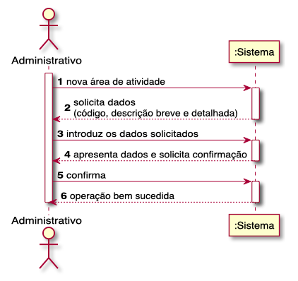
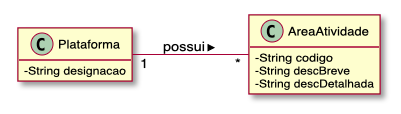
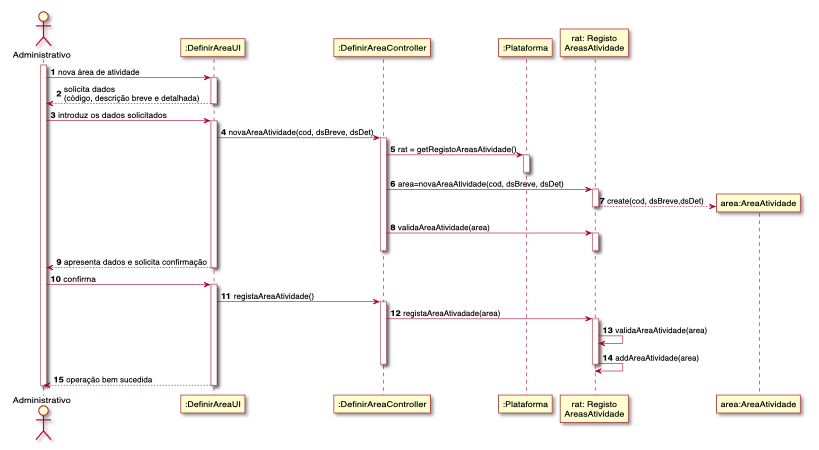
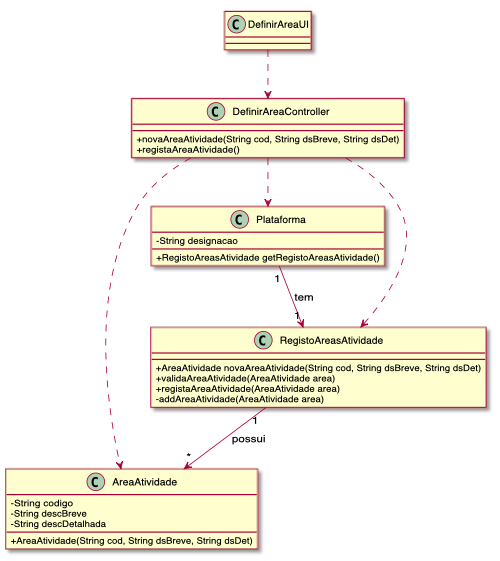

# UC02 - DEFINIR ÁREA DE ATIVIDADE

O administrativo inicia a definição de uma nova área de atividade. O sistema solicita os dados necessários (i.e. código único e descrição breve e detalhada). O administrativo introduz os dados solicitados. O sistema valida e apresenta os dados ao administrativo, pedindo que os confirme. O administrativo confirma. O sistema regista os dados e informa o administrativo do sucesso da operação.

## Diagrama de Sequência de Sistema

## Excerto do Modelo do Domínio

## Diagrama de Sequência

## Diagrama de Classes

##### [Voltar ao Enunciado](Enunciado.md)
