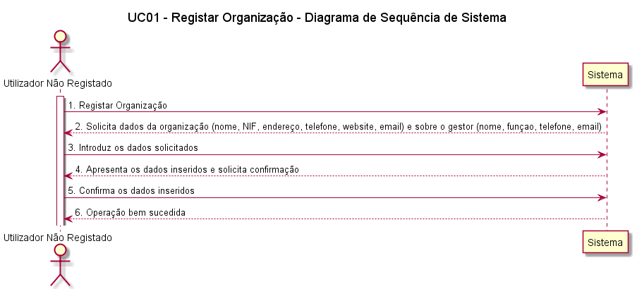
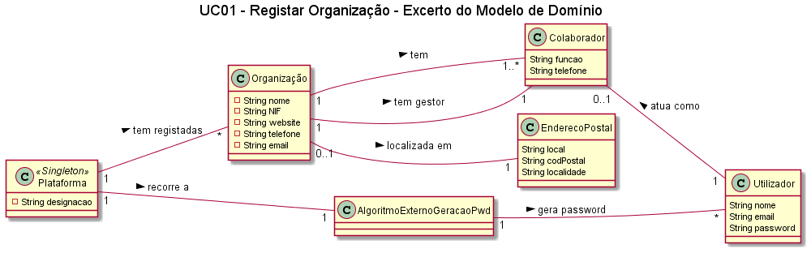
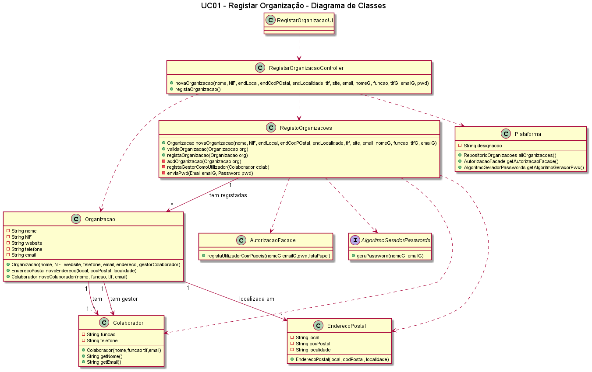
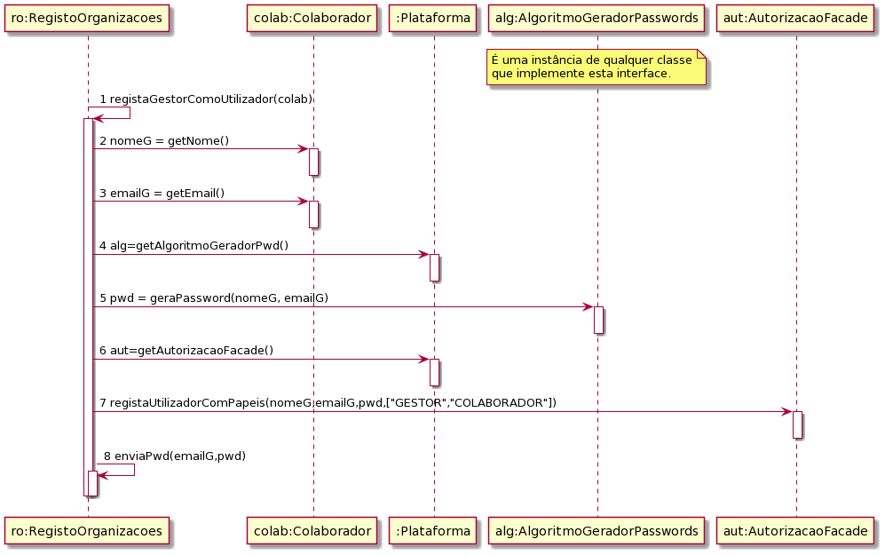
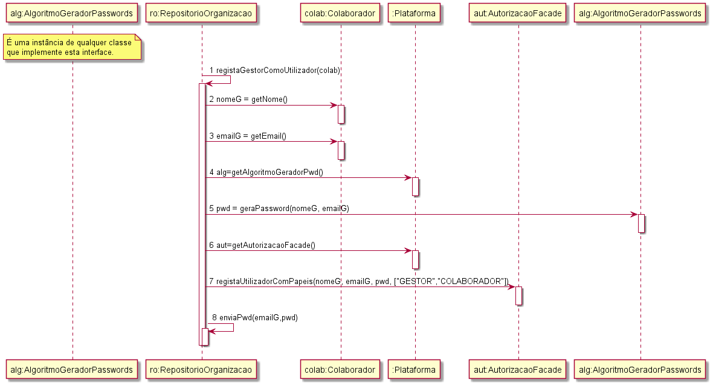

# UC01-Registar Organização

## Formato Breve

O utilizador não registado inicia o registo de uma organização. O sistema solicita os dados
necessários sobre a organização (i.e. nome da organização, o NIF, o endereço postal, um
contacto telefónico, o endereço web, email) e sobre o colaborador (i.e. gestor) que está a
proceder ao registo (i.e. nome, função, contacto telefónico e email). O utilizador não
registado introduz os dados solicitados. O sistema valida e apresenta os dados, pedindo que
os confirme. O utilizador não registado confirma. O sistema regista os dados da organização
e do seu colaborador/gestor, tornando este último um utilizador registado, remetendo-lhe
a sua palavra-passe (gerada pelo sistema) por email e informa o utilizador não registado
do sucesso da operação.

## Formato Completo

**_Ator Primário:_**

- Colaborador da Organização

**_Partes interessadas e seus interesses:_**

- Organização: pretende ficar registada na plataforma
- T4J: pretende que as organizações se registem

**_Pré-condições:_**

* A plataforma tem de permitir o registo de organizações

**_Pós-condições_**

* A organização fica registada na plataforma

**_Cenário de sucesso principal:_**

1. O colaborador inicia o registo de organização.
2. O sistema solicita os dados necessários (Nome Organização, NIF, Endereço, Telefone, Email).
3. O colaborador introduz os dados solicitados.
4. O sistema valida e apresenta os dados ao colaborador, pedindo que os confirme.
5. O colaborador confirma os dados.
6. O sistema regista os dados e informa o colaborador do sucesso da operação.

**_Fluxos Alternativos:_**

1. O colaborador solicita o cancelamento do registo da organização. O caso de uso termina.
2. Dados mínimos obrigatórios em falta:  
  a. O sistema informa quais os dados em falta.  
  b. O sistema permite a introdução dos dados em falta.  
  c. O colaborador não insere os dados. O caso de uso termina.
3. O sistema deteta que os dados (ou algum subconjunto dos dados) introduzidos devem ser únicos e que já existem no sistema: 
  a. O sistema alerta o colaborador para o facto. 
  b. O sistema permite a sua alteração. 
  c. O colaborador não altera os dados. O caso de uso termina.

## SSD

## Excerto do Modelo de Domínio

## Diagrama de Sequência

## Diagrama de Classes

##### [Voltar ao início](https://github.com/blestonbandeiraUPSKILL/upskill_java1_labprg_grupo2/tree/main/README.md)
