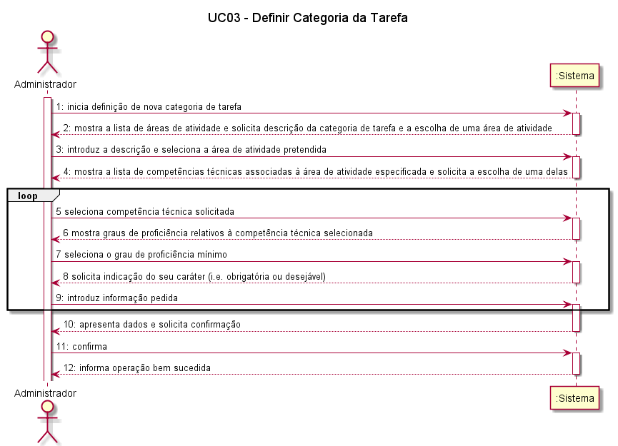

# UC03-Definir Categoria de Tarefa

## Formato Breve

O administrativo inicia a definição de uma nova categoria de tarefa. O sistema solicita os dados necessários (i.e. descrição, área de atividade e lista de competências técnicas requeridas e respetiva caracterização). O administrativo introduz os dados solicitados. O
sistema valida e apresenta os dados ao administrativo, pedindo que os confirme. O administrativo confirma. O sistema regista os dados e informa o administrativo do sucesso da operação.

## Formato Completo

### Actor Principal

* Administrativo

### Partes interessadas e seus interesses

* Administrativo: pretende criar categorias de tarefa uma vez que a existência delas é um requisito para a criação de tarefas na  plataforma.
* Colaborador da organização: pretende ter uma oferta variada de categorias de tarefa às quais possa associar as tarefas que cria.
* T4J: pretende que a plataforma atribua com sucesso as tarefas publicadas por organizações, a candidatos (freelancers) que se propõem a realizá-las.

### Pré-condições

1. A plataforma tem que ter pelo menos um Administrativo registado.
2.	É necessário que já exista pelo menos uma área de actividade à qual se possam associar categorias de tarefas.
3.	É necessário que existam competências técnicas definidas que possam ser associadas às diferentes categorias de tarefas.

### Pós-condições

* É criada/definida com sucesso uma categoria de tarefa, que fica disponível para a associação de tarefas.

### Cenário de sucesso principal

1. O colaborador inicia o registo de organização.
1.	O administrativo inicia o processo de definição de categoria de tarefa.
2.	A plataforma devolve a lista de áreas de actividade e competências técnicas existentes na plataforma.
3.	O administrativo seleciona uma área de actividade, juntamente com as competências técnicas, definindo o grau mínimo exigido para as mesmas, assim como se são obrigatórias ou opcionais.
4.	O administrativo insere o nome da categoria de tarefa assim como a sua descrição.
5.	A plataforma valida os dados.
6.	Depois de validados os dados, a plataforma  retorna os dados ao administrativo para que este confirme o registo desta categoria de tarefa.
7.	O Administrativo confirma o registo, e a categoria de tarefa é então registada na plataforma.
8.	O caso de uso termina.

### Fluxos alternativos

1. A plataforma não tem nenhuma área de actividade definida.
*  a. O caso de uso termina.
2. A plataforma não tem nenhuma categoria de tarefa definida.
*  a. O caso de uso termina.
3. O administrador não pretende associar nenhuma competência técnica à categoria de tarefa, associando a categoria de tarefa apenas a uma área de actividade
*  a. O caso de uso decorre de acordo com o fluxo principal, mas não são escolhidas, inseridas, nem validadas competência técnicas associadas a esta categoria de tarefa.
4. O sistema detecta algum erro durante a validação dos dados.
*  a. O sistema solicita ao administrador a correção dos erros.
*  b. O caso de uso decorre de acordo com o fluxo principal.

## SSD

## Excerto do Modelo de Domínio

## Diagrama de Sequência

## Diagrama de Classes

##### [Voltar ao início](https://github.com/blestonbandeiraUPSKILL/upskill_java1_labprg_grupo2/tree/main/README.md)