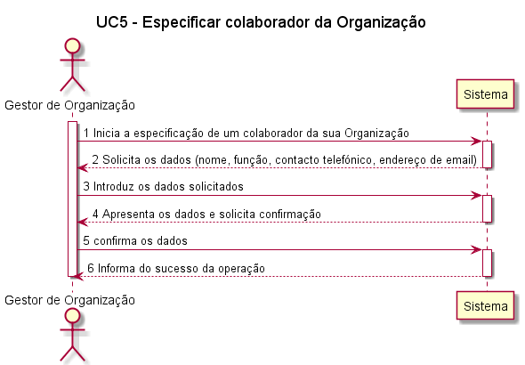
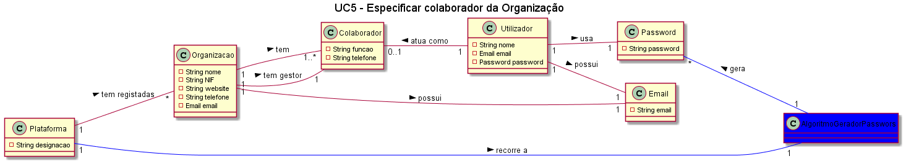
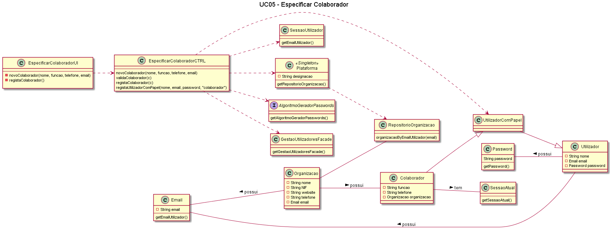

# UC5 - Especificar Colaborador da Organização

## Formato Breve

O gestor de organização inicia a especificação de um colaborador da sua organização. O
sistema solicita os dados necessários (i.e. nome, função, contacto telefónico, endereço de
email). O gestor de organização introduz os dados solicitados. O sistema valida e apresenta
os dados ao gestor de organização, pedindo que os confirme. O gestor de organização
confirma. O sistema regista os dados do colaborador, gera uma password para o
colaborador, tornando este num utilizador registado, envia, por email, os dados de acesso
ao colaborador e informa o gestor de organização do sucesso da operação.

## Formato Completo

**_Ator Primário:_**

- Gestor de Organização

**_Partes interessadas e seus interesses:_**

- Gestor da organização: Pretende que a organização tenha colaboradores registados na plataforma;
- Organização: Pretende ter colaboradores registados na plataforma;
- Colaboradores: Pretendem estar registados na plataforma de forma a estarem habilitados a fazer uso da mesma;
- Plataforma: Pretende ter mais utilizadores registados.

**_Pré-condições:_**

- A Organização deve estar registada na plataforma;
- O Gestor da Organização deve estar registado na plataforma;
-O Gestor deve ter login válido.

**_Pós-condições_**

- Os colaboradores especificados ficam registados na plataforma;
- Os colaboradores especificados recebem, por email, as suas credenciais de acesso;
- Os colaboradores ficam habilitados a especificar e publicar tarefas na plataforma.

**_Cenário de sucesso principal:_**

1. O gestor de organização inicia a especificação de um colaborador da sua organização;
2. O sistema solicita os dados necessários para o registo;
3. O gestor de organização introduz os dados solicitados;
4. O sistema valida e apresenta
os dados ao gestor de organização, pedindo que os confirme; 
5. O gestor de organização confirma os dados inseridos;
6. O sistema regista os dados do colaborador e informa o gestor de que a operação foi realizada com sucesso.

**_Fluxos Alternativos:_**

1. O Gestor da Organização cancela o processo de inserir/especificar um colaborador. 
    a. O caso de uso termina.
2. O Gestor da Organização verifica que não existem mais colaboradores para inserir. 
    a. O caso de uso termina.
3. O Gestor da Organização introduz dados inválidos:    
    a. O sistema permite a correção dos dados introduzidos (Passo 3). 
    b. O Gestor da Organização não altera os dados. c. O caso de uso termina.
4. O sistema deteta que os dados (ou algum subconjunto dos dados) introduzidos devem ser únicos e que já existem no sistema: 
    a. O sistema alerta o gestor para o facto.
    b. O sistema permite a sua alteração (passo 3). c. O Gestor da Organização não altera os dados. O caso de uso termina.

## Diagrama de Sequência de Sistema 

## Excerto do Modelo de Domínio 

## Diagrama de sequência  

![UC05_Especificar_Colaborador_Diagrama_Sequencia]UC05_Especificar_Colaborador_Diagrama_Sequencia.png)

## Diagrama de Classes  

## Plano de Testes  

[UC5 - Especificar Colaborador de Organização - Plano de Testes](UC05_Especificar_Colaborador_Organizacao_Plano_Testes.md)

##### [Voltar ao início](https://github.com/blestonbandeiraUPSKILL/upskill_java1_labprg_grupo2/blob/main/README.md)

