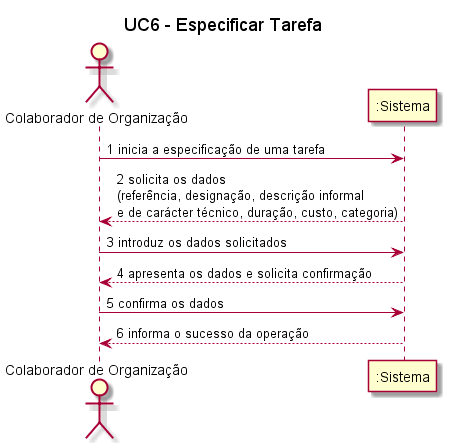
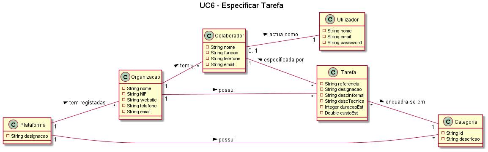
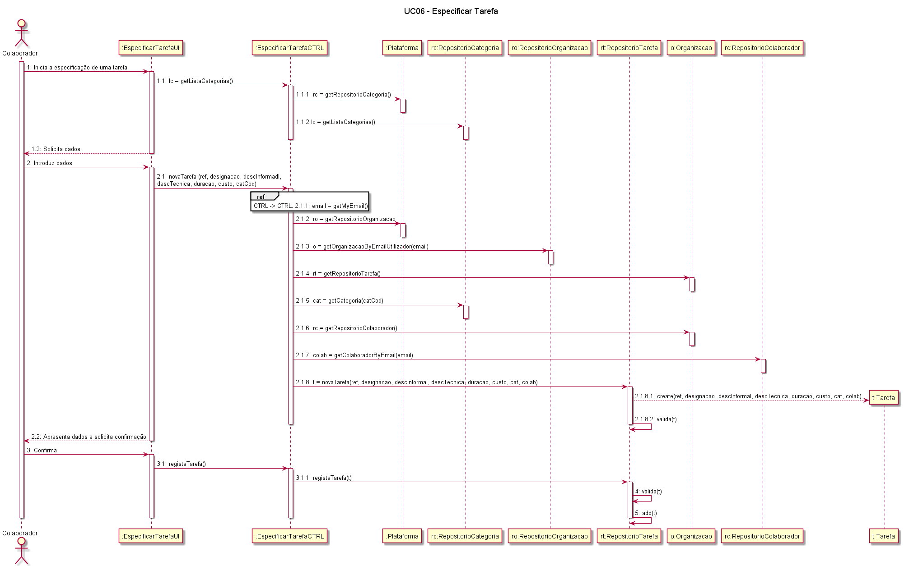
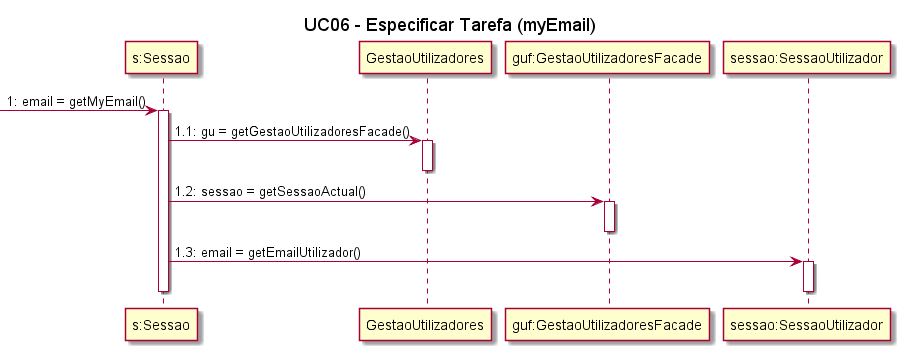
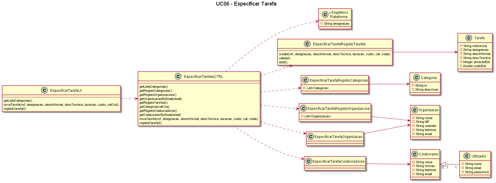

# UC6 - Especificar Tarefa  

## Formato breve   
O colaborador de organização inicia a especificação de uma tarefa. O sistema solicita os dados necessários (i.e. uma referência única por organização, uma designação, uma descrição informal e outra de carácter técnico, uma estimativa de duração e custo, a categoria). O colaborador de organização introduz os dados solicitados. O sistema valida e apresenta os dados ao colaborador de organização, pedindo que os confirme. O colaborador de organzação confirma. O sistema regista os dados e informa o colaborador de organização do sucesso da operação.

## Diagrama de Sequência do Sistema  

## Excerto do modelo de domínio  

## Diagrama de sequência  

## Diagrama de classes  

##### [Voltar ao início](https://github.com/blestonbandeiraUPSKILL/upskill_java1_labprg_grupo2/blob/main/README.md)